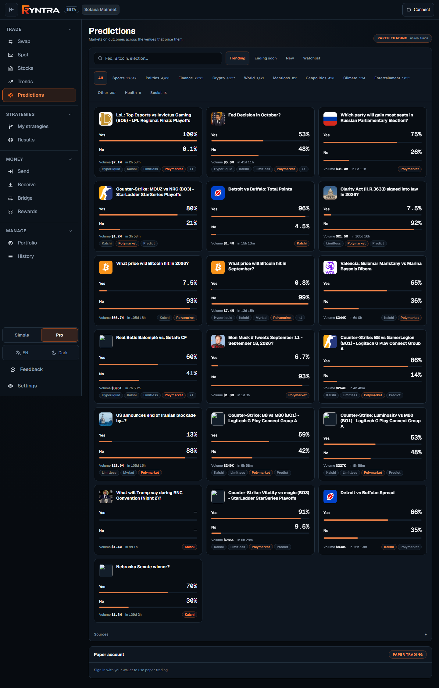
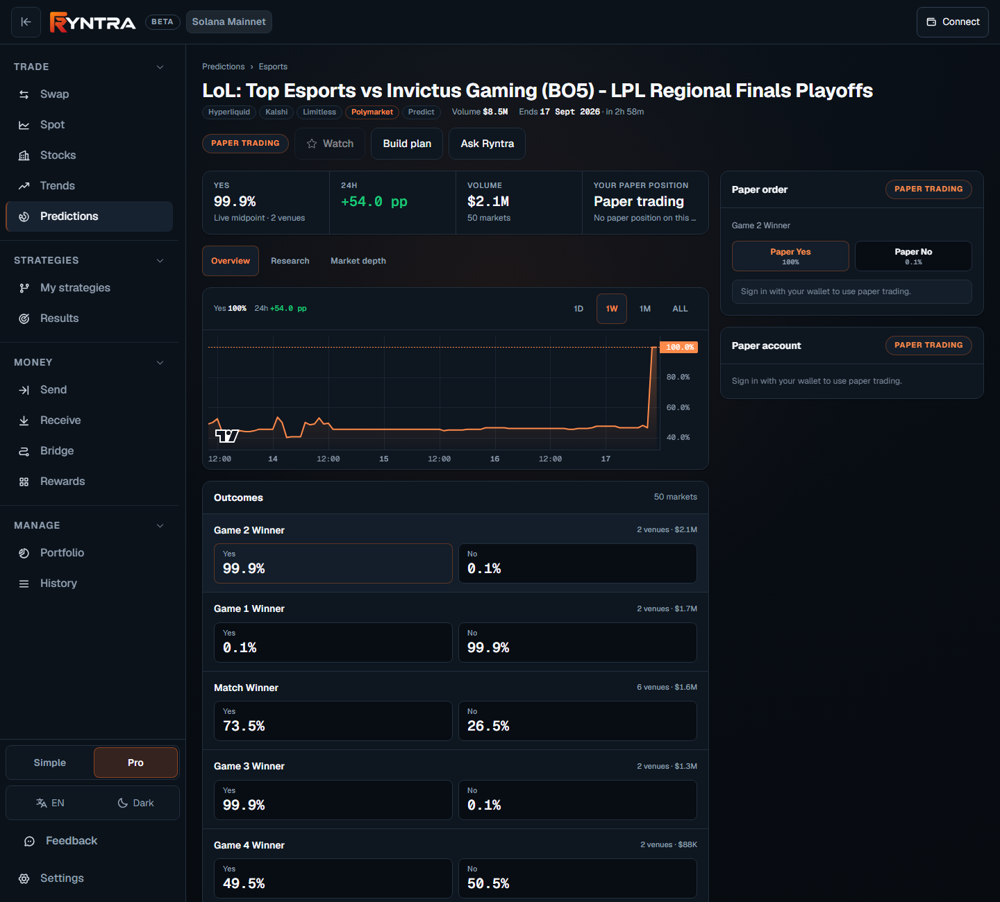
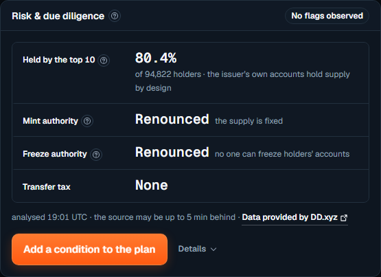
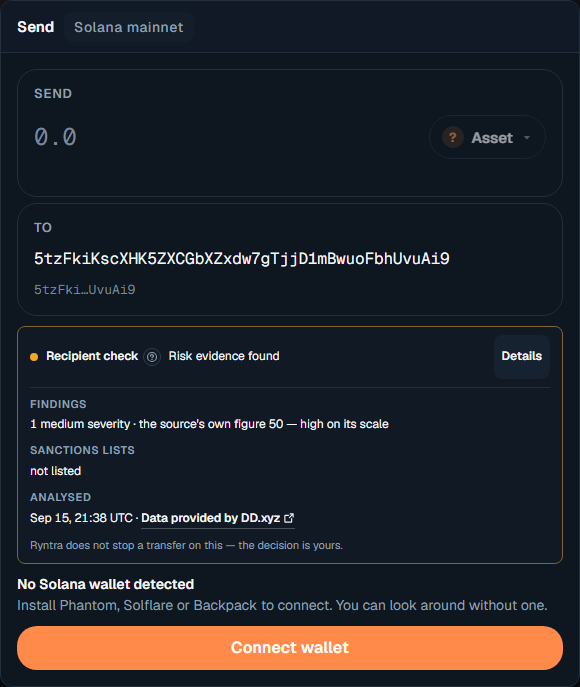
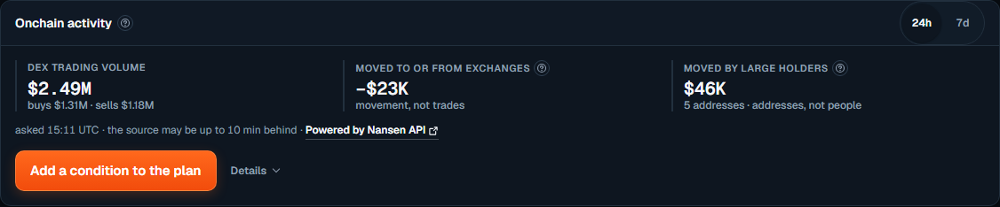
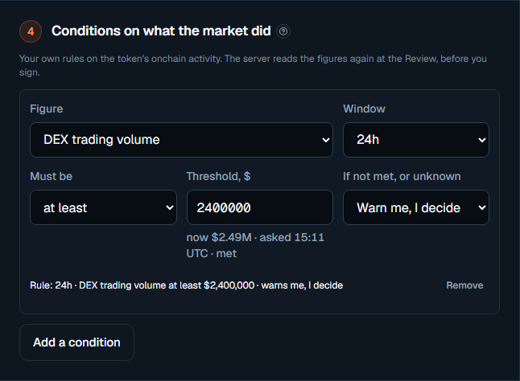
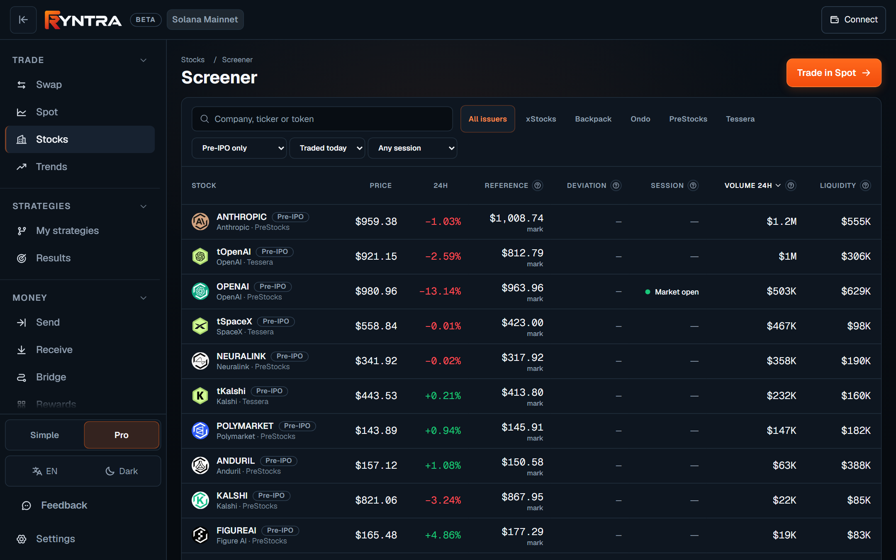
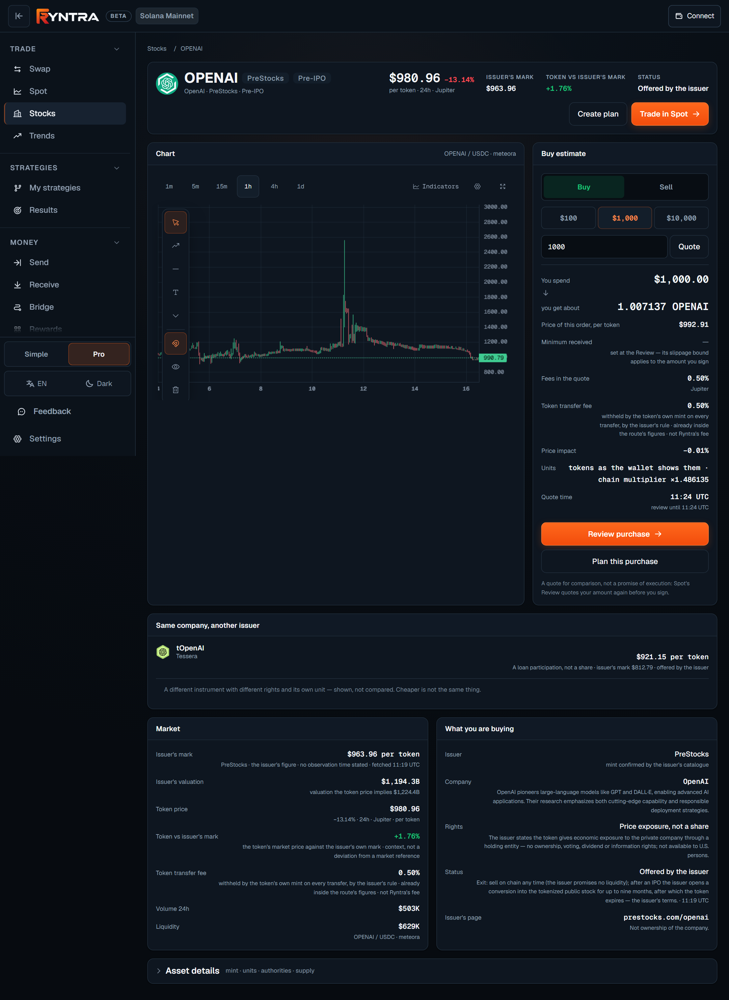

# Ryntra build log

What has shipped in the Ryntra product, newest first. Each entry is one completed slice of work released on the live product at [ryntra.io](https://ryntra.io); *verified on the live product* means the slice was checked there after release. The product is developed in a private repository; this log is its public record, generated from structured entries and published with the open-source components in this repository.

Entries dated before Sep 16, 2026 record earlier shipped work, written down when the public build log was introduced; the dates are the dates the work shipped.

Evidence kit version in this repository: `1.4.0`. Machine-readable status: [`docs/product/status.json`](docs/product/status.json). Product documentation: [`docs/product/README.md`](docs/product/README.md). Repository: https://github.com/ryntra-io/ryntra-solana-evidence.

## Sep 17, 2026 — Predictions: markets on outcomes, with a plan, a Review and paper trading

**Predictions** · verified on the live product

A prediction market is a market on an outcome: a share of Yes pays $1 if it happens and $0 if not, so its price is the market's probability. Predictions lists these markets across the venues that trade them — the same question priced side by side — with search, trending, ending soon, the venues' own categories and a watchlist. A market opens into its outcomes and live probabilities, the day's change, the volume, the time to resolution, and one tap deeper into Research and Market depth. A Prediction Plan is written in three steps, a Review states what an order pays if right and loses if wrong, and the order goes to a paper account: simulated funds, no real money, the word paper everywhere.

- Discovery across venues: the question, the leading outcomes with their probabilities, the volume, the venues that trade it and the time to the end on every card; what moved since you watched it, and what needs attention.
- Research that keeps everything the aggregator gives and names its sources: each venue's live price, the price history, related markets, generated signals with the model named, the ripple effect, news, and each venue's own resolution rules.
- Market depth for those who want it: the aggregated order book with each level's venue breakdown, the books by venue, live trades, venue prices and the cross-venue return where one is computed.
- A Prediction Plan native to outcomes — thesis, outcome, amount, entry probability, an optional bound, invalidation, the resolution deadline, monitoring conditions — sized on the plain fact that the whole amount is the most you can lose.
- A Review before every paper order: the outcome, the amount, what it pays if right, what you lose if wrong, the fees, the quote's age, the venues, the settlement summary, the plan's conditions and every check; one action — Place paper order.
- Paper throughout: a paper balance, paper orders and paper positions on the account, shown apart from the real portfolio and tagged in History; live prediction trading is a separate decision that has not been taken.
- One account: enabling paper trading takes one signature with your wallet; the provider's session is held by the server behind your account and never reaches your browser.

*The Predictions hub: search, trending, ending soon, the venues' own categories with their counts, and the cards — the question, the leading outcomes with their probabilities, the volume, the venues and the time to the end.*

*A market: the outcome's live probability, the day's change, the volume, the paper position, the chart, the outcomes per market and the paper order ticket beside them — paper trading, said as such.*

Open source in this repository: [`lib/predictions/plan-model.ts`](lib/predictions/plan-model.ts), [`lib/predictions/failure.ts`](lib/predictions/failure.ts).

Live: https://ryntra.io/app/predictions

## Sep 16, 2026 — Risk & due diligence: how the token is built, as a rule of the plan

**Trading plans** · verified on the live product

A second evidence source answers a different question on the asset page — not what the market did, but how the token itself is built. Risk & due diligence reads it when you ask: the share the ten largest holders hold and how many addresses hold the token, whether the mint and freeze authorities are present or renounced, whether the token taxes every transfer, and what the source's early-holder labels hold now. Any of those facts can become a rule of the plan; at the Review the server reads the structure again and judges the rule beside the money checks. Before a transfer, Send shows what the same source knows about the recipient. No score, no verdict — the vocabulary has no word for safe.

- Four facts with their meaning, not a wall of fields: the top-ten share with the holder count, the mint authority, the freeze authority, the transfer tax; the early-holder labels as one line on a meme token and under Details elsewhere.
- An issuer-backed instrument is read in its own context: a supply held by the issuer's own accounts and a kept freeze right are the design of a tokenized stock, and the card says so beside the figure instead of dressing them as a warning.
- The state in the card's head counts facts — an authority present, a tax above zero — with no threshold behind any of them; a figure the source did not measure is a dash, never a zero.
- A rule on the structure: the top-ten share at most a bound you write, the transfer tax at most a percent, an authority renounced or present — required refuses the version when the fact is not as written or cannot be read.
- The Review names every source it read — when, how far behind it may be, whose data — and a plan without a structure rule, like every trade outside a plan, never waits on this source.
- The recipient check in Send: sanctions in the source's own words, findings as counts by severity, unsupported for a program, a vault or an exchange contract the source cannot analyse — never a verdict, never a block.
- Every call is reserved against a daily and a monthly ceiling and settled on the provider's own price; address lists never leave the adapter; @ryntra/evidence opens the second adapter with network-free tests.

*The Risk & due diligence card after Check on a tokenized stock: the top-ten share with the issuer's context, both authorities renounced, no transfer tax, the source's analysis time and lag, and one press to add a condition.*

*The recipient check in Send: what an external security source found about the address, the sanctions screening in the source's own words, when it was analysed — and the line that the decision stays the person's.*

Open source in this repository: [`lib/evidence/metrics.ts`](lib/evidence/metrics.ts), [`lib/evidence/address.ts`](lib/evidence/address.ts), [`lib/evidence/flags.ts`](lib/evidence/flags.ts), [`lib/evidence/rights.ts`](lib/evidence/rights.ts), [`lib/evidence/providers/ddxyz/mapper.ts`](lib/evidence/providers/ddxyz/mapper.ts), [`packages/evidence/src/index.ts`](packages/evidence/src/index.ts).

Live: https://ryntra.io/app/stocks/NVDAx

## Sep 16, 2026 — Onchain evidence inside the trading plan

**Trading plans** · verified on the live product

A plan can now carry rules on what the market did, beside its price and money rules. On the asset page, Analysis reads a few figures from an external onchain source when you ask — the day's or the week's DEX trading volume with its buys and sells, the net movement of the token to or from the addresses the source labels as exchanges or as large holders — each with the time Ryntra asked, how far behind the source may be, and the source named. One press turns a figure into a condition of the plan; at the Review the server reads the figure again and judges the rule beside the checks on the money and the deal, keeps what it judged, and Results shows it beside the fill.

- Analysis on the asset page and in Spot: three facts on request, never on every row — the source is asked only when you ask, and a second reader within the window costs nothing.
- Every figure with its provenance: when Ryntra asked, how far behind the source may be, when the figures stop counting as current; a figure the source does not have is a dash, never a zero.
- Conditions in the plan builder, prefilled from the card with the figure as it stands; a labelled group's movement can warn but never refuse — a movement is not a trade and a label is not a person.
- The Review judges each condition on a fresh read before the signature; unmet, stale, unknown or unavailable is never a pass, so a rule that refuses also refuses when it cannot be judged.
- The plan page shows each condition against the figure now; Results shows what the Review knew before the signature, with the source's attribution beside it.
- Only the provider families its redistribution terms allow are called, with attribution; nothing restricted or prohibited is; every call is reserved against a credit ceiling and settled on the provider's own headers.
- The evidence layer is open source as @ryntra/evidence: the registry, the observation, the validator and the judge, the rights map, the governor contract and the adapter, with a live example under your own key.

*The Onchain activity card after Analysis: the day's DEX trading volume with buys and sells, the movement to or from exchanges and by large holders, the time asked, the source's lag and attribution, and one press to add a condition.*

*A condition in the plan builder: the figure, the window, at least or at most, the threshold beside the figure as it stands now, and whether an unmet or unjudgeable rule warns or refuses the order.*

Open source in this repository: [`lib/evidence/metrics.ts`](lib/evidence/metrics.ts), [`lib/evidence/conditions.ts`](lib/evidence/conditions.ts), [`lib/evidence/rights.ts`](lib/evidence/rights.ts), [`packages/evidence/src/index.ts`](packages/evidence/src/index.ts).

Live: https://ryntra.io/app/stocks/NVDAx

## Sep 16, 2026 — Pre-IPO stock instruments

**Tokenized stocks** · verified on the live product

Tokens that give exposure to companies before an IPO joined the stock desk as their own instrument class, with PreStocks and Tessera as confirmed issuers. Each mint is checked against the issuer's own catalogue; the token is the unit, the issuer's own figures are shown as the issuer's mark and never as a market reference, the rights are stated in the issuer's words, and a token the issuer no longer supports is not offered for purchase.

- PreStocks and Tessera added as confirmed issuers; a token appears only when the issuer's catalogue lists its mint.
- Pre-IPO tokens priced per token, with the issuer's mark named as the issuer's mark — context, not a reference the plan checks against.
- Holder rights stated in the issuer's own terms on the asset page: price exposure through a holding entity, or a loan participation — not a share.
- The transfer fee a token's own mint withholds is read from the chain and shown inside the quote, never added twice.
- Token lifecycle from verified issuer notices: a conversion window with the issuer's cut-off, an expired token refused for purchase whatever a pool still quotes.
- A Pre-IPO filter in the screener and a same-company card that shows another issuer's token beside the one open — shown, not compared.
- A pricing defect fixed on the way: the list had divided a scaled-unit price by the multiplier a second time.

*The screener on Pre-IPO only: issuer tabs, the issuer's mark labelled as such where a market reference would stand, the exchange session, the traded volume.*

*A pre-IPO asset page: the price per token, the issuer's mark and the premium to it, the transfer fee the mint withholds inside the estimate, the rights in the issuer's words, the token's status with the issuer.*

Open source in this repository: [`lib/stocks/instrument.ts`](lib/stocks/instrument.ts), [`lib/stocks/lifecycle-events.ts`](lib/stocks/lifecycle-events.ts), [`lib/stocks/units.ts`](lib/stocks/units.ts).

Live: https://ryntra.io/app/stocks/screener?kind=preipo

## Sep 16, 2026 — The plan builder in three steps

**Trading plans** · verified on the live product

The Trading Plan builder was reordered into the three questions a person actually answers — why this stock, how much money, at what prices — with every other rule behind one disclosure and a sensible default. Numbers are read the way they were typed, the estimate updates as you type, and the plan states its own unit.

- Three steps: the thesis in your words, the budget and planned risk, the entry and the price where the thesis is wrong.
- Costs, validity, target and execution limits behind “More rules”, each with a default that holds.
- A number typed with a comma, a space or a currency sign is read as the person meant it; an empty field is never zero.
- The entry prefilled from the market; a pre-IPO plan says it is priced per token and that the issuer's mark is not a market reference.
- The plan estimate — units, notional, modelled loss at the invalidation — computed as you type, with its assumptions beside it.

*The plan builder in three steps with the estimate computed beside it: units, the modelled loss at the invalidation, the costs modelled, the entry's validity.*

Open source in this repository: [`lib/plans/decimal-input.ts`](lib/plans/decimal-input.ts), [`lib/plans/sizing.ts`](lib/plans/sizing.ts).

Live: https://ryntra.io/app/strategies/new

## Sep 16, 2026 — Operations ledger behind the public statistics

**Analytics** · verified on the live product

The public statistics page now reads Ryntra's own ledger of confirmed operations: a row appears the moment an operation confirms, nothing is estimated, and the subset that can be proven independently on Solana is shown as its own figure, verified transaction by transaction against public chain data.

- Executed volume, operations, wallets and gross fees from the ledger, filterable by product and period.
- Every operation links to the transaction that proves it; the on-chain verified count is stated beside the total.
- Two numbers kept distinct on purpose: all confirmed operations, and the on-chain attributable subset.
- A public dashboard of the attributable subset, built from the same rule, linked from the page.

*The overview of the public statistics: executed volume, operations, wallets and gross fees by product and period, with the number verified on chain beside the total.*

Live: https://ryntra.io/stats

## Sep 15, 2026 — Trading plans bound to the deal

**Trading plans** · verified on the live product

A Trading Plan is a set of rules a person writes before they sign: the thesis, the money, the entry, the invalidation, the exit. The plan now lives on the server with versions, its size is computed deterministically from the rules, and the pre-signature Review judges the exact order against the plan before the wallet signs.

- Plan versions stored per wallet; the builder and the plan detail under My strategies.
- Deterministic sizing: units limited by the planned risk or by the budget net of costs, with the assumptions the figure stands on.
- The Review's Strategy block checks the order against the plan — the entry bound, the budget, the planned risk, the reference deviation — and says which rule refused.
- Plan versus actual: the result of a plan recorded from what was executed, kept with the plan.

Open source in this repository: [`lib/plans/sizing.ts`](lib/plans/sizing.ts).

Live: https://ryntra.io/app/strategies

## Sep 15, 2026 — Deal terms and token alternatives on the asset page

**Tokenized stocks** · verified on the live product

The asset page states the terms of your deal for the amount you type — what you spend, what you receive, the price per share, the fees inside the quote, the price impact — and compares the confirmed tokens of the same underlying side by side: the same amount, the same settlement asset, the same side, quoted together.

- Buy and Sell estimates for a typed amount, with the minimum received set at the Review rather than promised here.
- Per-share prices through each token's own multiplier, so tokens with different scaling compare on one basis.
- The comparison names the issuer of each token and says plainly that cheaper is not the same rights or less risk.
- One click into the same Spot ticket or the same plan builder for the token chosen.

*A listed-equity asset page: the reference price, the deviation and the session; the estimate per share through the token's multiplier; the confirmed tokens of the same company quoted for the same amount.*

Open source in this repository: [`lib/stocks/units.ts`](lib/stocks/units.ts).

Live: https://ryntra.io/app/stocks/NVDAx

## Sep 15, 2026 — A versioned API contract for native clients

**Platform** · shipped

Ryntra's native client and the web application now share one versioned contract: a wallet signs in and receives a bearer session, capabilities are discovered rather than assumed, and the watchlist, search, candles, Trading Plans and their Review block are one shape for both clients.

- Sign-in with Solana into a bearer session; capabilities announced by version.
- The watchlist with one merge rule, search and candle limits stated in the contract.
- Version 1.1.0 adds the Trading Plan, its Review block, its execution binding and a device registry.
- Android app links declared so the native client can open Ryntra addresses directly.

Live: https://ryntra.io/docs

## Sep 15, 2026 — The stock desk: Discover, the screener, one shared universe

**Tokenized stocks** · verified on the live product

The stock desk became a page of its own: Discover with its collections, a screener with search and issuer tabs, and one universe of confirmed tokens shared across server instances and streamed behind the page's own skeleton so the list never arrives half full.

- Collections — most traded, most liquid, gainers, losers — each with the rule it is built on.
- Search by company, ticker or token; tabs per issuer; filters by session and by what traded today.
- Provider budget respected: background reads wait their turn, a quote asks once more, and a partial universe is never kept.
- A market reference stated for US-listed underlyings whose issuer publishes none, when a price feed is available for it.

Open source in this repository: [`lib/stocks/session.ts`](lib/stocks/session.ts).

Live: https://ryntra.io/app/stocks

## Sep 14, 2026 — Tokenized stocks on Solana

**Tokenized stocks** · verified on the live product

Stocks arrived as a first-class market: tokens confirmed against the issuers' own catalogues, the issuer's reference price and the exchange session beside the token's market price, units read from the chain's own multiplier, and a quote that knows the size it is quoting.

- Confirmed representations from xStocks, Backpack and Ondo catalogues; a token the issuer does not list is not a stock here.
- The issuer's reference price and the exchange session, with the state of the reference — current, last available, stale — never promoted.
- Units from the chain: the Scaled UI Amount multiplier turns a raw balance into the shares a holder economically owns, computed with integers.
- A size-aware quote per share and the deviation from the reference, stated as a fact about this quote at this time.

*The Spot terminal on a tokenized stock: the reference price and its state, the deviation, and a quote naming the provider, the route, the service fee and the underlying units behind the token amount.*

Open source in this repository: [`lib/stocks/units.ts`](lib/stocks/units.ts), [`lib/stocks/session.ts`](lib/stocks/session.ts), [`lib/stocks/instrument.ts`](lib/stocks/instrument.ts).

Live: https://ryntra.io/app/stocks

## Sep 14, 2026 — Public site, documentation and one navigation

**Platform** · verified on the live product

The public site became the front door of the product, the documentation describes the product that exists, and the landing and the application share one header, one footer, one language control and one theme.

- A new landing at ryntra.io showing the product itself, live, with the application one click away.
- Product documentation, the security statement and the policies at ryntra.io/docs, generated from the same facts the product runs on.
- One menu on every public page; English and Ukrainian; dark and light.
- The application's navigation reorganised: Stocks a page of its own, Bridge under Money, History where the operations are.

Live: https://ryntra.io/docs

## Sep 14, 2026 — Evidence kit 1.1.0

**Evidence kit** · shipped

The open-source Solana evidence kit in this repository moved to a neutral evidence envelope shared by every module, and its boundary verifier was hardened so that a file nobody listed, a sensitive filename in any path segment or a dependency outside the public registry fails the build.

- The evidence envelope generalised; public JSON formats, hashes and signatures unchanged.
- The boundary verifier refuses sensitive filenames in every path segment and requires every dependency to resolve from the public npm registry.
- The CLI's JSON verification exit status fixed earlier in the month: tampered or unrecognised receipts exit with code 2.

Open source in this repository: [`lib/evidence/envelope.ts`](lib/evidence/envelope.ts), [`scripts/verify-boundaries.mjs`](scripts/verify-boundaries.mjs), [`examples/solana-evidence-cli/cli.ts`](examples/solana-evidence-cli/cli.ts).

Live: https://ryntra.io/docs

## Sep 12, 2026 — Spot fills, and the Portfolio as a statement

**Trading** · verified on the live product

Every Spot market trades, a fill reads as a fill, balances stay true after an operation, and the account pages read the way a broker's statement does: Activity as a statement of operations, Portfolio as holdings with their value, Rewards as one composed page.

- Spot: every listed market executes on the same engine Swap uses; the coin is shown where the person looks.
- Balances refreshed truthfully after a swap; a swap reads as a swap.
- Activity as a statement; Portfolio as a broker shows it; the top bar carries one principal.

Live: https://ryntra.io/app/spot

## Sep 11, 2026 — The Spot terminal, and the wallet as the account

**Trading** · verified on the live product

One market terminal for Solana — Crypto, Memes and Stocks/RWA inside it — on the engine Swap already ran on, with a chart that is the market and a rate stated per mechanism. The same day the wallet became the account: no separate sign-up, Telegram an optional notification channel, and Ryntra Points inside Rewards.

- Spot terminal: market list, chart, ticket and asset details in one screen, columns that follow the screen size.
- The wallet is the account; Telegram connected from Settings as a notification channel only.
- Bridge extended to four more networks, each measured against its provider before being written down; a receipt for every bridge transfer.
- Ryntra Points inside Rewards; the brand identity applied across the product in dark and light.

Live: https://ryntra.io/app/spot

## Sep 10, 2026 — One service fee, and Rewards

**Trading** · verified on the live product

The service fee became one number — fifty basis points, taken through each provider's own fee mechanism and shown inside the quote — and Rewards opened: a share of the fee actually collected goes back to the people who brought the trader, claimable from one dollar.

- A 0.50 % service fee on swaps, collected through the provider's own pipe and already included in the quote shown.
- Rewards: 50 / 10 / 5 per cent of the fee actually collected shared across three levels of inviters; an inviter is chosen by the person, not assigned.
- The swap card shows what an amount is worth before it is signed; Swap became the front door of the application.

Live: https://ryntra.io/app/rewards

## Sep 7, 2026 — Unified Swap

**Trading** · verified on the live product

One swap form over three execution providers — Jupiter on Solana, Circle CCTP for USDC between Solana and Base, and Mayan for cross-chain routes — with one ticket, one network and asset selector, and a payment request that travels as a link.

- One form; the route chosen by what the person asks for, the provider named on the ticket.
- A segmented network · asset selector, one popover, 25 / 50 / 75 / MAX.
- Public payment requests as shareable links.

Live: https://ryntra.io/app/swap

## Sep 4, 2026 — One product shell

**Platform** · verified on the live product

The application became one product with six domains that fill the screen they are given, one wallet context asked for once, account and wallet as two distinct principals, and a public site that shows the product rather than describing it.

- Six domains under one shell; Home at the root; the network no longer changes when the domain does.
- One wallet context, never asked twice; account and wallet as two chips because they are two principals.
- The public product page and product map projected from the product itself; the Asset Passport at its own address.

Live: https://ryntra.io/app

## Sep 1, 2026 — USDC between Solana and Base through Circle CCTP

**Trading** · verified on the live product

A bridge for USDC between Solana and Base on Circle's CCTP, built as one card for a transfer that crosses two chains: plan, burn, attestation, mint, observation and recovery, with a signed receipt and the public verifier run against it. Opened after a real two-dollar transfer was signed and matched end to end.

- The execution path in the open: burn on the source chain, Circle's attestation, mint on the destination, independent read-back.
- A transfer survives a closed tab and resumes where it stood; waiting for Circle needs no button.
- Standard against Fast, both fees and the cost on Base shown in the Review before the signature.
- The direction travels with the transfer; the bridge runs both ways.

Live: https://ryntra.io/app/bridge

## Aug 29, 2026 — Send, and the pre-signature Review

**Risk review** · verified on the live product

Send on Solana mainnet with a Review before every signature: each token's capabilities read from its mint, safe recipients resolved, the exact fee, rent and simulation shown, a one-shot submit boundary, independent recovery and read-back, and a receipt retained for every transfer.

- Token capabilities classified from the mint's own extensions; a transfer that the token cannot clear is refused before it is built.
- The Review states the exact fee, the rent a new account costs and the simulation result before the wallet is asked to sign.
- Submit once: a signed transfer is not lost when the tab reloads, and recovery waits on the person's behalf.
- Receipts shown and retained; the swap gained the same order, execute and signed-receipt path the same week.

Open source in this repository: [`lib/solana/preflight.ts`](lib/solana/preflight.ts), [`lib/solana/receipt.ts`](lib/solana/receipt.ts).

Live: https://ryntra.io/app/send

## Aug 26, 2026 — Evidence kit 1.0.0 published

**Evidence kit** · shipped

The read-only Solana evidence kit was published in this repository under Apache-2.0: asset passports for Token-2022 mints, transfer preflight against a declared owner policy, offline receipt verification, a typed SDK, an MCP server, JSON Schemas and a CLI.

- Everything read-only by construction: no transaction is built, no key is held, and the boundary test proves it from the shipped sources.
- The same modules the product runs on, imported rather than copied.

Open source in this repository: [`packages/solana-evidence-sdk/src/index.ts`](packages/solana-evidence-sdk/src/index.ts), [`packages/solana-evidence-mcp/src/server.ts`](packages/solana-evidence-mcp/src/server.ts), [`examples/solana-evidence-cli/cli.ts`](examples/solana-evidence-cli/cli.ts).

Live: https://ryntra.io
