# Ryntra build log

What has shipped in the Ryntra product, newest first. Each entry is one completed slice of work released on the live product at [ryntra.io](https://ryntra.io); *verified on the live product* means the slice was checked there after release. The product is developed in a private repository; this log is its public record, generated from structured entries and published with the open-source components in this repository.

Entries dated before Sep 16, 2026 record earlier shipped work, written down when the public build log was introduced; the dates are the dates the work shipped.

Evidence kit version in this repository: `1.6.0`. Machine-readable status: [`docs/product/status.json`](docs/product/status.json). Product documentation: [`docs/product/README.md`](docs/product/README.md). Repository: https://github.com/ryntra-io/ryntra-solana-evidence.

## Oct 10, 2026 — Micro: a small market that reaches the DEX at 750 USDC, its launch fee all for the market

**Platform** · shipped

Ryntra Launch has a third preset for people. A Micro token reaches the DEX once 750 USDC is raised. Its whole 8% graduation fee goes to the market's own budget, none to the creator, and the creator still earns 40% of the curve's trading fees. The creator's first buy is capped at 2% of supply and goes under a lock with nothing unlocking for six months. The pool after graduation is locked for ever, as on every preset.

- Graduation at exactly 750 USDC raised; Meteora's own keepers move a curve of that size to the DEX too.
- The pool's fee falls from 2% to 0.25% as the market cap grows, and a quarter of the pool's fee goes back into its depth.
- The token page says plainly when a creator's required lock did not land.
- Both configs were rehearsed on devnet to the DEX before they were signed on mainnet, every field compared.

Live: https://ryntra.io/app/launch/new

## Oct 9, 2026 — The launch executor runs on mainnet, every step in the market's flight log

**Platform** · shipped

Ryntra's executor now runs on Solana mainnet every minute over every market launched on Ryntra. It sends a market's move to the DEX as soon as its curve fills, and sends it again by itself if a move does not go through. The token page's flight log records what the executor did and each state the market moved into after the curve. Ryntra can pause the executor on one market or on all of them, and every pause is in the log too.

- The move to the DEX goes out within a minute of a curve filling; a move that is refused or fails is sent again at once, then after a growing wait.
- The flight log notes the executor's first pass over a market and each state after the curve: the core market on the DEX, the ladder placed, its upkeep, maturity after thirty days on the DEX.
- A pause and its end show as one row in the log. While a market is paused, Ryntra signs nothing on it, and its market health says so.
- Ryntra's buy steps below the price are named for what they are: the Fee-Funded Liquidity Ladder. They promise no price, and what they buy isn't sold into a drop.
- The flight log's notes and the pause are in the open API, contract 1.37.0, additive.

Live: https://ryntra.io/app/launch/markets

## Oct 9, 2026 — Every market launched on Ryntra on one public page, and each token's market health

**Platform** · shipped

A new public page lists every market launched through Ryntra, read from the chain with no wallet needed: its stage, its way to the DEX, the pool's liquidity, what sellers can sell into down to 5% below the price, holders and the creator. Each token's page now shows its market health by fixed definitions, with everything that governs the market marked as a program's rule or Ryntra's policy.

- Launches on Ryntra: a row per market — its stage, the way to the DEX, the pool's liquidity, depth at −5%, the budget, holders over $1 and the creator's lock and sales; live markets first, no ranking by hand.
- Market health on every token page: executable depth at −2%, −5% and −10%, survival on the DEX, holders without pools, locks and Ryntra's wallets, the ten largest holders' share, the creator and Ryntra's executor.
- Ryntra's own launches are marked as technical validation, never shown as demand.
- What governs a market is marked: a rule a program enforces, which neither the creator nor Ryntra can change, or a policy Ryntra's server runs while it runs; the token's own rules are marked in Honest launch.
- What is not counted yet says so, what was not read says “not read”, and a count from the accounts found says “at least” — never a zero; under the figures, plainly: the price can fall, liquidity can be used up, Ryntra never holds your money.
- The flight log saves as JSON, and the same figures are in the open API: GET /api/v1/launch/markets, /markets/{mint} and /{mint}/health, API contract 1.36.0.

Live: https://ryntra.io/app/launch/markets

## Oct 9, 2026 — The trading terminal fits a laptop: the chart first, the order always in reach

**Trading** · shipped

Spot and the stock pages now lay out by the room they actually get beside the menu, not by the window, so a 1280–1536 px laptop shows the chart as the widest panel and ends it on the first screen. The market's name, price and figures sit on one compact line above it, the order stays in view under the top bar, and its action stays at the foot of the order while a long review scrolls under it.

- On a 1280 × 720 laptop the Spot chart is about 640 px wide and ends on the first screen; before it was about 250 px wide and started below the fold.
- The chart's height follows the height the window has left, so a taller screen gets a taller chart and a shorter one still sees all of it.
- Timeframes, 25 / 50 / 75 / MAX and the tabs keep a compact size under a mouse and grow to a finger's size on a touch screen.
- The order and the stock's purchase card stay in view below the top bar; «Sign» never sits under the window's edge.
- The markets open from the arrow beside the market's name on every screen, a menu under the name on a desk and a sheet on a phone, so the chart keeps the whole width beside the order.

Live: https://ryntra.io/app/spot

## Oct 9, 2026 — A shared trade shows up on X and Telegram as a large card, and Rewards sits in the header

**Portfolio & history** · shipped

A trade shared with a personal link now unfolds on X and Telegram as a large picture of the trade card, served next to the card's own page. Rewards moved into the header with the amount to claim, and the list of recent rewards opens folded to the latest few.

- The card's picture lives beside its page, where link previews can fetch it; old picture links redirect to the new address.
- Rewards in the header shows what can be claimed; its light breathes only when there is money to claim.
- Recent rewards show the four newest and «Show all» for the rest.

Live: https://ryntra.io/app/rewards

## Oct 9, 2026 — One wallet signature per visit: sign in once and every page is yours

**Platform** · shipped

Signing in with a Solana wallet is now one signature for the whole site. The sign-in itself proves the address on every page and in every tab, so Home, Spot, Portfolio, Rewards, Money and the notifications open without asking again. A locked wallet no longer signs anyone out, and a sign-in lasts thirty days while the person keeps using the site.

- One signature opens every page and every tab; a reload asks for nothing.
- Every page reads one shared answer that the server gives before the page draws, so a page never shows «Confirm wallet» to somebody who has just signed.
- A wallet that locks, switches accounts or restarts its extension is a pause, not a sign-out; a different address asks for a new sign-in, and Disconnect signs out.
- When the session store does not answer, the page says it is checking and keeps the session, instead of asking for a new signature.
- A wallet sign-in lives thirty days, like an email one, and renews while the person keeps using the site.

Live: https://ryntra.io/app

## Oct 8, 2026 — A launched token's trades in History, each with its signed receipt and a link to share

**Portfolio & history** · shipped

A buy or a sale of a Ryntra Launch token — on its bonding curve or in the pool it moved into — is now written like every trade: a row in History under Launch, a signed receipt read from the trade's own transaction, and Ryntra's part of the fee stated. Right after a trade the person can open the receipt and share the trade with their own link.

- History has a Launch filter: «Bought 47.3K NOWL for 10 USDC», the exact figures, the price, the fee paid and Ryntra's part of it in the row's details.
- The receipt is built from the program's own swap event and the transaction's balances, next to the quote the wallet signed, and says whether the trade received at least its minimum.
- On a launch's curve the fee is the curve's own; Ryntra's part is the partner's share of it and Meteora's referral, paid from Meteora's own fee — the person pays nothing on top.
- After a trade: the transaction, its receipt, and «Share this trade» with the person's own link to the token.
- Launch trades count on the public statistics as their own product, attributed by the receipt read from the chain.

Live: https://ryntra.io/app/activity

## Oct 7, 2026 — Every launched token keeps a flight log: each event with its time, amount and transaction

**Platform** · shipped

A Ryntra Launch token's page now keeps its flight log: what happened to the token, the newest first, each entry with its time, its amount and the transaction anyone can open. The creator's sales stand there with the share of what they bought sold by then, and the graduation to the DEX names who sent it.

- The launch and the creator's first purchase, the creator's lock and the sharing of the creator's fees are each an entry with its transaction.
- Every sale of the creator's is an entry: how many tokens, for how much, and what share of what they bought they had sold by then — of the supply when they sold more than they bought.
- The graduation to Meteora's DAMM v2 pool says the amount the curve held and who sent the migration: Ryntra, Meteora's own keeper or another wallet.
- When the creator's trades could not all be read, the log says so: a sale not read is never shown as none.
- The same log is served to the phone as GET /api/v1/launch/{mint}/journal, API contract 1.32.0.

Live: https://ryntra.io/app/launch/new

## Oct 7, 2026 — A recurring buy for any token with liquidity, next to Market in every order

**Trading** · shipped

A recurring buy is no longer only for tokenized stocks: any token with liquidity — a company, a coin like SOL, a meme or a new token — can be bought every day, week or month, when its price falls, or from every USDC payment, within a monthly budget. Recurring stands next to Market in the order of every token. Ryntra reminds and the person signs every purchase; the money stays in the wallet.

- Recurring sits beside Market in Spot's order on every token: the rule is written, paused or deleted right there, and a reminder's link opens the same order set to the rule's purchase.
- A meme or a new token shows the facts of its risk before the button — its age, liquidity, the ten largest holders, whether anyone can still mint or freeze it, its organic score and whether Jupiter verified it.
- A token needs $25,000 of liquidity in its pools and 24 hours since its first pool. The floor is read again before every reminder and at the order: under it the purchase waits, and one note says why.
- On a coin the price condition stands against the market price when the rule is turned on: the rule does not buy above the limit the person chose.
- All rules live in Bots → My bots, each with its switch, next to the trade plans.

Live: https://ryntra.io/app/spot

## Oct 6, 2026 — Share a trade: a card of your result with your invite link

**Platform** · shipped

From Portfolio or a token's page, a person whose wallet is signed in can pick one of their trades made through Ryntra and turn it into a picture for X or Telegram. A sale shows its result in percent against the average price paid through Ryntra, with the entry, the exit and how long it was held; a purchase shows only its price and date. The card carries the token, the person's rank, a QR code and their invite link, which opens a page with the card and leads to the token in Ryntra. Every figure is recomputed on the server from the wallet's receipts, never taken from the request.

- A loss is shown at the same size and in the same place as a profit; a sale whose cost is unknown makes no card.
- Dollar amounts appear only when the person turns them on, and the wallet's address never appears.
- An invite link can now lead to any page of the app — a token, a launch — and only to this site's own pages.
- The first season of the weekly rankings starts in the week ten people outside Ryntra have traded through it, never earlier; until then the season page says seasons have not started.

Live: https://ryntra.io/app/portfolio

## Oct 6, 2026 — Every page takes the width of the screen it is on

**Platform** · shipped

On a wide screen Ryntra's pages no longer sit in a narrow column at the left edge: launching a token, My launches, a token's page, Bots, Settings and the rest use the whole width — a form beside its review, cards that fill their row, the totals beside the list — while a single action such as Swap or Send stands in the middle.

- Launch a token: the form's sections in two columns on a wide screen, with the token's card and the review beside them from the first moment.
- My launches: the launches across the page, the earnings and the receipts beside them; a wide card shows all its figures in one row.
- Bots, the catalog, Home, a company's page, Portfolio and Settings fill the screen at 1920 and 2560 pixels; Top up, Send, Receive and Swap stand in the middle.
- A test now fails any page that caps its own width, and every page is measured on the rendered screen at 1440, 1920 and 2560 pixels.

Live: https://ryntra.io/app/launch/mine

## Oct 6, 2026 — A launch that lands is always shown, and every launched token can be bought and sold

**Platform** · shipped

Ryntra no longer answers «nothing landed» for a token launch that reached Solana: a launch is called failed only when the chain is past its blockhash and no node holds its signature or its mint, and a mint on chain is a launch. A launch Ryntra has no record of is restored from the chain itself, and buying and selling a launched token reads the wallet's own token account directly.

- A token's mint exists only once its creation lands, so a mint on chain makes the launch live — whatever a single node says of the signature.
- «Not landed» needs every node asked to answer, from a slot past the blockhash's height, that it holds no such signature; a node that did not answer is never read as «absent».
- A launch whose record was lost is restored from its creation transaction when Ryntra's pool payer paid for and signed it on one of Ryntra's curve configs, so its page, My launches, trades and fee claims serve it.
- Launching, trading and claiming answer within a minute even when every node stalls; what was not read in time is said as pending and settled from the chain, never as an error on a transaction that landed.
- A wallet's balance of a launched token or of USDC is read from its own token account by address, the account a trade spends from; a refused read is an error, never a zero.

Live: https://ryntra.io/app/launch/new

## Oct 6, 2026 — One menu around launch, trade and bots, and one screener for every asset

**Platform** · shipped

Ryntra's menu is rebuilt around what people do: Launch a token on top, then Home and Markets; Trade, Launch and Bots; Portfolio, Money and Rewards. Markets is one screener for tokenized stocks, private companies, crypto and memes, and the search in the header opens a token from its contract address.

- Markets is one table with tabs — All, Memes, Crypto, Stocks, Private, Watchlist — and each kind keeps its own columns: market cap, the hour, pool age and top holders for coins; the session and the deviation for stocks.
- The order is the person's own — Trending, Gainers, Losers, Moving now, Newest, Liquidity or any column; deposit receipts such as jlUSDC are not rows.
- A section's pages are tabs at the top of it: Spot and Swap; Launch a token and My launches; My bots and Catalog; Positions and History; Top up, Send, Receive and Cross-chain.
- Bots gathers everything that runs on a person's rule: the recurring-buy rules and the trade plans, each plan's result on its card. Every buy is still signed by the person.
- The search finds a token by name, ticker or pasted contract address; Ask Ryntra opens the assistant with the screen as its context; every old address leads to its new place.

Live: https://ryntra.io/app/markets

## Oct 6, 2026 — Ryntra Launch: your Solana token on a Meteora bonding curve in one signature

**Platform** · shipped

Launch is now in Ryntra's menu on Solana mainnet. Name a token, add its picture, pick a preset and sign once: the token opens on a Meteora Dynamic Bonding Curve and moves to a Meteora DAMM v2 pool when the curve fills. Every fair-launch mark is an account anyone can open, and the token's page shows its market, holders and facts of risk read from the chain.

- Two presets: Classic — snipers pay a fee falling from 20% to 1% over 2 minutes, the creator may buy up to 5% of supply; Protected — from 50% to 1% over 10 minutes, up to 2%. The creator earns 40% of trading fees in both.
- Every token is Token-2022 with a fixed supply of 1,000,000,000: mint and freeze authority revoked, metadata fixed at launch.
- An optional first buy lands in the same transaction that opens the curve, under the preset's cap, and can be locked with vesting.
- After the DEX, the creator's and Ryntra's liquidity is locked for ever; My launches shows what each token earned by source and claims it in one transaction.
- Launch's curve configs, fee collector and pool creator are published with their first transactions on the attribution page; API contract 1.30.0 serves Launch on mainnet.

Live: https://ryntra.io/app/launch/new

## Oct 5, 2026 — Rewards ranks: a share of the fee Ryntra receives, growing with your rank

**Platform** · shipped

Rewards now share the fee Ryntra actually receives. Half of it comes back to you as cashback in USDC; the person who invited you earns 10–30% of it by their rank, and the person who invited them 5%. The payouts from one fee never exceed what arrived. The Rewards page shows your rank — Bronze, Silver, Gold, Sapphire or Diamond — by rank points over the last 30 days, where the points came from, how many the next rank needs, and what a friend's trade pays at each rank.

- A rank point is a dollar of fee Ryntra received on your own trades or on trades of friends you invited.
- Ranks begin at 0, 100, 1,000, 10,000 and 50,000 rank points; the inviter's share is 10%, 15%, 20%, 25% and 30%.
- Every reward keeps the rules and the inviter's rank it was computed with; earlier trades keep their earlier shares.
- When the rank cannot be read, the page says so instead of showing Bronze.
- API contract 1.26.0 adds the rank to the Rewards answer; existing clients read it unchanged.

Live: https://ryntra.io/app/rewards

## Oct 4, 2026 — The Ryntra fee by what you trade, shown as an amount before you sign

**Trading** · verified on the live product

Ryntra's fee now depends on what you trade: 1% on new and meme tokens, 0.5% on other verified tokens, 0.1% on major coins, 0.25% on tokenized stocks, 0.5% on Ondo and PreStocks, and nothing on a dollar-to-dollar swap. On the web, swaps are built through Jupiter's router with the fee paid straight to one public Ryntra fee wallet, and the Review shows the fee as an amount before you sign. The same amount appears in the receipt and is checked against the transaction on chain.

- Swap, Spot and the stock sheets show «Ryntra fee» with its rate and amount in the Review, before the signature.
- The fee is simulated before you sign: a transaction that would pay a different fee, or a fee above the rate, is refused.
- The receipt records the fee the chain shows arrived at the fee wallet, and says whether it matches the Review.
- Where Jupiter's request-for-quote route gives a better price after its share, and for Ondo, the swap uses Jupiter's order route as before.
- API contract 1.24.0 names the new path and fee mechanism; existing clients keep reading the order route unchanged.

Live: https://ryntra.io/docs/reference/fees

## Oct 4, 2026 — Stats by product and the public fee addresses

**Analytics** · verified on the live product

The public stats page now shows executed volume, operations, users, fees paid, revenue and cashback, split by product and by payment network, all from the operations ledger. A new section lists every public address that receives Ryntra's fees, with the block it started at and an example transaction read from the chain, and the same list is published as JSON for Dune queries and analytics adapters.

- Six figures and one table: product by network, with a total row; every filter's totals are computed on the server.
- A fee without a dollar figure is shown as unknown with the reason, never as zero; a stablecoin is valued at par only by its mint, not by its symbol.
- Revenue is Ryntra's share of fees minus the cashback paid back to the person who traded.
- Public addresses: network, products, role, address, start and an example transaction; the start and example are read from the chain, not typed in.
- The attribution rule 1.2.0 also recognises per-product fee wallets through their canonical token accounts; the referral path counts exactly as before.

Live: https://ryntra.io/stats

## Sep 29, 2026 — Lighter Home and Portfolio

**Portfolio & history** · verified on the live product

Home and Portfolio load a smaller initial interface bundle. Receipt verification starts only when there is a receipt to check, while existing balance refresh and transaction checks remain in place.

- Network identifiers for receipt links use a small shared module without an RPC dependency.
- Receipts still need valid integrity and issuer signatures before resolving a pending history entry.
- A failed verification load or a wallet change leaves unverified entries pending.

Live: https://ryntra.io/app/home

## Sep 29, 2026 — Portfolio risk on Home

**Portfolio & history** · verified on the live product

Home now says one word for the whole wallet, by Ryntra's published rules: Normal; Attention, with the reason and one action; or Could not check, with what could not be read — never Normal on incomplete data. The verdict is decided on the server from the wallet itself, so every client that asks gets the same one.

- Normal: no position has reached its loss limit or target, no asset is above 25% of the wallet, private companies together are at most 10%, and no listed company goes into the weekend without a loss limit.
- Attention names every rule that is broken, the most urgent first, each with one action: open the sale, set up a warning, or take a look.
- Could not check says what was not read — the wallet's tokens, the market, a position's limit or a price; a token Ryntra cannot vouch for is left out of the count.
- The 25% cap applies from a wallet of $500, the 10% cap at any size; dollars count in the total and have no cap.

Live: https://ryntra.io/app/home

## Sep 29, 2026 — Help and privacy for the Android app

**Platform** · verified on the live product

Ryntra has a support page in English and Ukrainian: the guides that answer most questions, History with every receipt, the Android app's own facts, and one inbox sorted by what the letter is about. The privacy policy has a section on the Android app in both languages — what stays on the phone, that the app sends Ryntra only the public address of the wallet you connect, and that a push token reaches Ryntra only once you turn phone notifications on. ryntra.io also publishes the app's release certificate, the statement a wallet reads to verify the app when it connects.

- The support page puts answers first: what to do when something did not work, what each status means, History with receipts, common questions.
- The privacy policy names what the phone keeps — the session in secure storage, the watchlist, the last Home screen, preferences — and what signing out deletes.
- A push token is sent to Ryntra only after phone notifications are turned on; turning them off removes the phone's registration.
- The Digital Asset Links on ryntra.io name the Android app's release certificate, so a wallet can verify the app at connect.

Live: https://ryntra.io/support

## Sep 28, 2026 — Ryntra will warn you: every position watched

**Portfolio & history** · verified on the live product

Every company a wallet holds now reads one state with one action: On track, Attention, Action needed — the loss limit or the target reached, with the sale one press away — or Paused by the issuer. A position bought without an exit says so in one amber line, «Attention: bought — no exit set», and one press turns on «Ryntra will warn you» with a loss limit and a target set from the price now.

- Two presets set the exit from the price now — Careful and Balanced — and the warning arrives in Telegram with the sale one press away.
- In Portfolio the state is a line of the position itself: its word, a small range from the loss limit through the price to the target, and one action.
- On the company's page and in Monitoring a panel draws where the price stands between the loss limit and the target.
- Ryntra only watches and warns; every sale is the person's own signature.

Live: https://ryntra.io/app/portfolio

## Sep 28, 2026 — Buy and sell a company in under a minute

**Tokenized stocks** · verified on the live product

The path from a company's page to a signed purchase was measured on the live product and cut from eight presses to five. A $1 purchase of Apple took 18 seconds from the page to the signature, and the sale of the whole position 28 seconds, one transaction each.

- The sum takes a new figure in one press: the sheet opens on $10 selected and the next key replaces it, so $1 is a press and a key.
- On a phone the sheet rises above the keyboard, so the action is never hidden under it.
- When the venue refuses a quote or an order only for its request rate, Ryntra asks once more after the venue's own short pause instead of failing the purchase; a submitted transaction is never sent twice.

Live: https://ryntra.io/app/stocks/AAPLx

## Sep 27, 2026 — Sell from your position

**Tokenized stocks** · verified on the live product

A company you hold now sells where you see it: Sell beside Your position on the company's page, and Sell on the position in Portfolio. Type a sum in dollars or take a share of the position in one press — 100% is exactly what you hold; the sheet says at once how many dollars the sale brings and what it costs. The Review is four lines, the wallet signs, and the receipt says Sold with the sum.

- The dollars arrive as USDC in the person's own wallet, and the sale is in History with its receipt.
- A PreStocks token may not sell — the issuer promises no liquidity — and the sheet says so before the signature.
- A PreStocks sale pays the issuer's fee on the transfer, read from the chain, on its own line under All costs.
- The four lines of the Review and the account's one-time reserve are counted by the server on the quote and the order, the same for the web and the phone.

Live: https://ryntra.io/app/portfolio

## Sep 26, 2026 — Autoinvest from every payment

**Tokenized stocks** · shipped

A third kind of Autoinvest rule sets money aside for a company from the wallet's own USDC on Solana: round every payment up to the next $1 or $5, put a fixed sum aside from every payment, or a per cent of every USDC that comes in. A $3.40 payment rounded up to $1 sets $0.60 aside for NVIDIA. The sum gathers until it reaches the purchase minimum; then Ryntra reminds, the Review is fresh, and the wallet signs one purchase.

- Swaps, Ryntra's own purchases and transfers between the person's own accounts never count, and each payment counts once.
- Ryntra reads the payments, which are public on the chain, and never moves them; the rule plans reminders and is not a permission to spend.
- Each purchase passes the rule's price condition and counts against the month's budget like every other rule.
- The API contract carries the new rule for native clients.

Live: https://ryntra.io/app/autoinvest

## Sep 26, 2026 — A price condition on every Autoinvest rule

**Tokenized stocks** · shipped

An Autoinvest rule can now refuse to buy too dear. On a company with a reference price — PreStocks' valuation for a private company, the issuer's reference per share for a listed one — a rule carries a condition: don't buy if it costs more than a chosen per cent above the reference, 5% unless the person picks another, or no condition at all. When the price is past it, or the reference is too old to judge, the purchase waits and says why.

- The condition is chosen on the rule's own sheet, which shows how the price stands against the reference right now.
- A purchase the condition stops reads «Purchase deferred» with the reason, the figure and the time of the data it was judged on, and the rule checks again.
- The Review before the signature carries the condition's line, and the notifications say when a purchase waited.
- Data too old to judge waits as well: an unknown is never read as a pass.

Live: https://ryntra.io/app/autoinvest

## Sep 25, 2026 — The company's path — from a private company to its token on Solana

**Tokenized stocks** · verified on the live product

Under a company's name its page now draws one strip of four steps — private, the IPO, the exchange, the token on Solana — each passed, current or not announced yet, with its date. SpaceX has a token at two of those steps: the PreStocks token from before its listing and xStocks' SPCXx after it. Both pages draw the same strip, each marks the step of its own token and opens the other in one press, and under the strip stands the day the PreStocks token must be swapped. A private company that has announced nothing stands at the first step, with the issuer's own rule for what follows an IPO.

- Four steps under the company's name — Private · PreStocks, IPO, Exchange, Solana — each passed, current or not announced yet, with its date; the sources are one press deeper.
- SpaceX's IPO is read from the company's own filings with the SEC: the price per share from the final prospectus, the first day of trading from the pricing term sheet.
- SPACEX and SPCXx are one company at two steps: each page says what its token is — not a share and a 1% issuer fee on every transfer for the private one, backed 1:1 with no vote for the listed one — and opens the other in one press.
- Under the steps the PreStocks token's swap deadline is written with the issuer's minute in UTC; on that token's own page a holder's swap stands inside the strip.
- A private company that has announced nothing stands at the first step, with the issuer's rule: after an IPO, up to nine months to swap the token.
- The API contract adds the path to a stock's row in 1.17.0; nothing that exists changes shape.

Open source in this repository: [`lib/stocks/lifecycle-events.ts`](lib/stocks/lifecycle-events.ts).

Live: https://ryntra.io/app/stocks/SPACEX

## Sep 25, 2026 — A company page that says what the company is

**Tokenized stocks** · verified on the live product

The page of every company now carries the company's facts at rest, as figures with their source and date: its size and results from its own filings with the SEC, what it does, where it is and where it lists, what exactly the token is and what backs it, and how the token trades on Solana. On a wide screen the company fills the main column and its purchase stays in view beside it; on a phone the same blocks read top to bottom, with the purchase on the first screen.

- Key statistics: market value, price to earnings, revenue and net income over twelve months and the dividend, from the company's own filings with the SEC, dated and linked; the price over the year from the token's own line.
- About the company: what it does in one line, its industry, headquarters, exchange and ticker, fiscal year and latest report.
- What you buy: the issuer's label, the backing from the issuer's proof of reserves, what happens to dividends and whether the issuer takes a fee on a transfer.
- Trading on Solana over the day: volume, liquidity, holders, traders, trades, and buying against selling.
- A fund, a foreign issuer and a private company show the facts they have; nothing a source does not state is drawn, never a zero.
- The day's line is drawn without a pool's one-trade spikes: each point is the median of itself and its neighbours, always a price the pool printed.

Live: https://ryntra.io/app/stocks/NVDAx

## Sep 25, 2026 — Buy a piece of a company from one dollar

**Tokenized stocks** · shipped

A purchase, a recurring buying rule and the month's budget now start at one dollar instead of ten. Every sum from a dollar is the person's own choice on their own budget; the purchase sheet opens on $10 as a plain default, any sum can be typed, and 25%, 50%, 75% or 100% of the wallet's USDC is one tap away. Before the change the live quote of one dollar was read for the twelve most traded companies and the eight private ones: every one of them has a route.

- The least a purchase, a rule's purchase and a month's ceiling can be is $1; any sum can be typed, and a purchase takes 25%, 50%, 75% or 100% of the wallet's USDC in one tap.
- A new buying rule opens on $10 every week as a default, the sum typed — every day, every week or every month, from a dollar, is the person's own choice.
- Where the live quote finds no route for the sum typed, the sheet asks the same quote for larger sums and states the company's own minimum, with one action to use it; nothing is claimed when the venue does not answer.
- The first purchase of a token opens its account in the wallet: the Review states that reserve on a line of its own under all costs — in SOL, once, it stays in the wallet — and says it first if it is ever more than the purchase.
- The API contract relaxes the minimums in 1.16.0: a rule's sum and a month's budget from one dollar, published by the capabilities; no shape changes.

Open source in this repository: [`lib/stocks/units.ts`](lib/stocks/units.ts).

Live: https://ryntra.io/app/stocks/NVDAx

## Sep 25, 2026 — The IPO and conversion watch — a pre-IPO token never left to expire

**Tokenized stocks** · shipped

When a private company goes public or is bought, its PreStocks token has a deadline: it must be swapped before the issuer's cut-off, or it expires worthless. Ryntra now says so on the token's page before any figure and before a purchase, tells a holder in the portfolio and in their notes, offers one action — swap into the listed token — and a quieter one — sell for USDC — and reminds them on the day it first sees the token in their wallet and 90, 30, 7 and 1 days before the deadline. SpaceX is the first: its window into SPCXx is open until 23:59 UTC on 12 March 2027.

- The event stands under what the token is, before the price, for everyone; a holder reads «Swap SPACEX by March 12, 2027 — after the deadline the token expires worthless.» with the swap as the page's one action and the sale beside it.
- The swap is an ordinary trade at the live quote, as the issuer describes the conversion; its Review shows all costs with the issuer's 1% fee on its own line and the rate against the exchange price. No ratio is promised.
- Route, the issuer's minute in UTC, what the listed token is and the issuer's own notice are one press deeper, under Details.
- Reminders come on the day a token is first seen in the wallet and 90, 30, 7 and 1 days before the deadline, at most once a day and never caught up; the balance is read from the chain, never taken from the page.
- A purchase of a token with a deadline says it before any sum; once the issuer's cut-off passes, no purchase is quoted, whatever the registry still says.
- The issuer's product pages are read against the registry of events every day; a new or changed notice is recorded for a person to verify before anyone is told.
- The portfolio counts and values a token in the unit the wallet shows — the raw balance through the multiplier in force — so a token with a five-for-one split no longer reads as a fifth of its value.

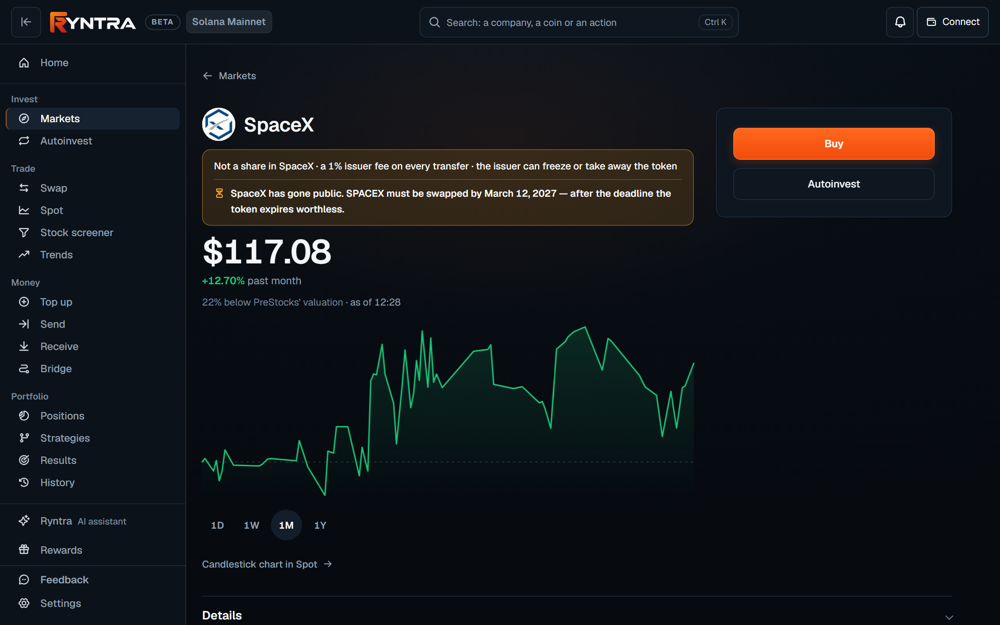

*A private company that has gone public: what the token is, and under it the issuer's swap deadline — before the price, for everyone.*

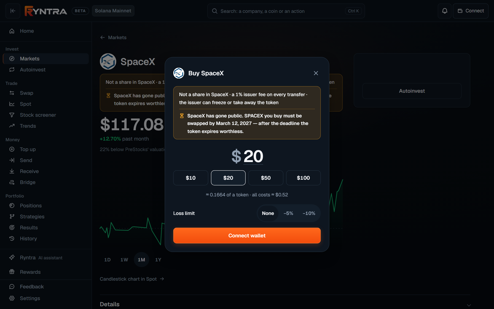

*Buying a token with a swap deadline: the deadline stands under what the token is, before any sum.*

Open source in this repository: [`lib/stocks/instrument.ts`](lib/stocks/instrument.ts), [`lib/stocks/lifecycle-events.ts`](lib/stocks/lifecycle-events.ts).

Live: https://ryntra.io/app/stocks/SPACEX

## Sep 25, 2026 — Private companies through PreStocks only — Tessera disconnected

**Tokenized stocks** · shipped

Private companies now come to Ryntra through PreStocks alone, and Tessera is disconnected: its tokens are no longer listed, quoted or offered anywhere, and a token bought earlier reads as history — its page, Spot and the Portfolio say it is no longer supported in Ryntra and that it can be sold in the holder's own wallet. Each of PreStocks' eight companies carries one number before a purchase: the token against PreStocks' own valuation, with the time that valuation was read.

- Private companies lists PreStocks' eight companies, each with its price in dollars and one number — such as 29% above PreStocks' valuation — and the time of that valuation on the reader's own clock.
- Before any figure, a private company's page says the token is not a share, carries a 1% issuer fee on every transfer and can be frozen or taken by the issuer; a company's own dated warning about tokens like it stands below, with sources.
- The chart of a PreStocks company opens on a month, since a day of a thin market draws a saw; the day, week and year stay one tap away.
- The Review of a PreStocks purchase names the issuer's 1% fee on its own line under All costs, and You get is the venue's quote after the fee, with the token's multiplier applied.
- The screener's deviation column holds the token against the issuer's valuation for pre-IPO rows, labelled as exactly that; a filter chosen while the page is still loading is applied once it is ready.
- Tessera's tokens are refused on either side of a quote and an order, left out of search and Spot's lists, refused for new plans and Autoinvest, and paused in monitoring; an old plan or receipt still opens and reads as history.
- The API contract grows additively to 1.14.0: slim stock rows carry markPremium and markAt, and values recorded before the disconnection stay readable.

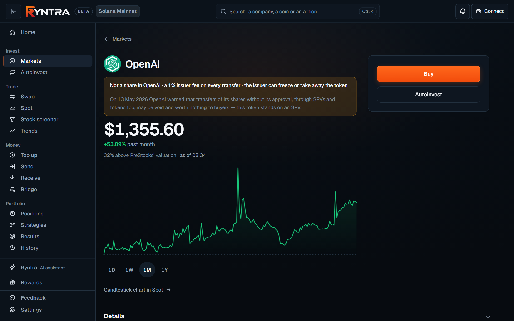

*A private company's page: what the token is not, the issuer's fee on every transfer and its power over the token before any figure, the company's own dated statement, and the price with its one number.*

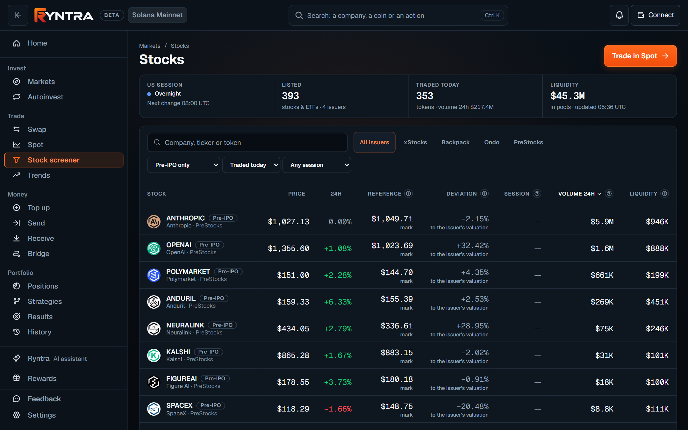

*The screener on Pre-IPO only: PreStocks' eight companies, the issuer's mark where a market reference would stand, and the token against the issuer's valuation where a deviation would stand.*

Open source in this repository: [`lib/stocks/instrument.ts`](lib/stocks/instrument.ts), [`lib/stocks/lifecycle-events.ts`](lib/stocks/lifecycle-events.ts).

Live: https://ryntra.io/app/markets?tab=private

## Sep 23, 2026 — Buy a tokenized stock with a loss limit you set

**Tokenized stocks** · shipped

A stock page now starts where a first purchase starts: with Buy. Pick an amount and, if you want one, a loss limit — Careful at −5% or Balanced at −10% — and Ryntra prepares the purchase from your own figures as one card: what you can lose at that limit, where the limit and the target sit, how you will be warned, and that nothing is bought yet. Accepting writes the plan and opens the same Review every trade passes, with the same amount, and your wallet signs. After the purchase settles, the plan keeps watching the position against its limit until the position is closed. A limit is a rule of your plan, not an order: you can still lose everything.

- Buy comes first, with $10, $20, $50 and $100 one tap away and any amount still typed by hand; each screen has one orange action, and the header's Buy steps back while the purchase card's own action is on screen.
- Careful puts the limit at −5% and the target at +10%; Balanced at −10% and +20%. The card states what you can lose at the limit, including the price cushion the Review allows before it refuses.
- The path is drawn on the card — intent, limits, permission, execution, proof, oversight — with the step you are on marked. Nothing moves past permission without your wallet's signature.
- Accept and sign writes an active plan and opens Spot's Review bound to it: a fresh executable quote, the plan's price ceiling and loss limit checked, then the signature. A price that ran too far is refused, not chased.
- After the fill the position stays watched against its limit until it is closed. Reaching the limit brings one note — on the page, and on Telegram if you connected it. Ryntra never sells for you: a sale is yours to open and sign.
- What you are buying, in one label under the symbol — Backed tracker, or Economic exposure · private — with a ? in the issuer's words; for xStocks, the dividends already in your amount through the multiplier.
- Where it trades: the Meteora card leads with the primary pool, the one paired with a stablecoin or SOL, in a single line until you open it.
- An issuer catalogue that fails to answer no longer hides a stock: the last complete copy is served, marked by its age, and a ticker it cannot confirm is reported as not known right now rather than not found.

Open source in this repository: [`lib/stocks/units.ts`](lib/stocks/units.ts).

Live: https://ryntra.io/app/stocks/SPYx

## Sep 22, 2026 — Results — what actually happened, against what you planned

**Platform** · verified on the live product

A plan used to end at the signature. Now the page it returns to answers what a careful person actually asks: what happened against what I intended. An operation is read as an entry or an exit — from the side the signed record itself carries, never guessed afterwards — and the gap between the price you planned and the one you paid is broken into parts that are never added together: the market before the review, execution after it, and the fee the settled record measured. An exit is judged only against the rules that existed before it. An open position says so rather than showing a zero. And a plan that never traded is a result too: it names the rule that refused it.

- Entry and exit are different events. The side comes off the signed record, so a sale is a sale rather than a purchase read backwards from which leg happened to be the stablecoin.
- The difference is three parts, never one number: the market before the review, execution after it, and the fee — each saying whether it was measured, modelled, or not established at all.
- What the review modelled before the signature stays labelled as modelled. A quoted fee is never called a paid one.
- An exit is judged against the version of the plan in force when it settled — and only that version. A target written the week after is reported as not applied, not as a rule the exit broke.
- A realised figure appears only when the position is closed, both sides are valued and every leg states a fee, and it names the method it was computed by. Otherwise the page says exactly what is missing.
- No trade is a first-class outcome. A maximum price that refused every review, a liquidity floor never cleared, a window that closed, a plan cancelled — each with the rule and the figures, and none of them called a failure.
- Strategy memory: facts about your own plans, reviews and operations, each citing the record it stands on. Nothing is stored as prose, so nothing can drift from what it describes, and no model can write to it.
- A holding in the portfolio now carries the plan it came from, so a position opens as the decision it started as.

Live: https://ryntra.io/app/results

## Sep 22, 2026 — Ryntra, the AI assistant — it researches and prepares, and it never executes

**Platform** · verified on the live product

A person can now ask Ryntra in their own words — why an asset is moving, what a plan would look like at a stated maximum risk, what a note means — and get one answer over the product's own reads: markets, evidence with its provenance, holdings, plans, history and monitoring. Every figure carries its source, its time and its state, and data that is missing is called missing instead of being smoothed over. The assistant has reading tools and preparing tools and no executing tool at all: a request to buy is refused and turned into a draft that opens the existing ticket, where a fresh quote, the Review, the person's confirmation and their own wallet signature decide.

- One conversation per wallet, kept on the server, reachable from any asset, plan, the portfolio or a monitoring note — and it knows where it was opened from.
- Ten reading tools over the services the product already uses and four preparing tools that return drafts in the product's own shapes; there is no execute tool to call, in any language.
- Every answer in six parts: what is known now, what it means, what could make that reading wrong, what is missing or stale, what to check, and neutral next steps — never an instruction to buy or sell.
- Every figure is printed as the read printed it, with the source and the time beside it; a figure the tools did not read, or a citation that does not exist, is removed from the answer before a person sees it.
- Asked to prepare a plan at a maximum risk of $50, it returns a draft — entry, invalidation, refusal price, the size that risk allows — and opens it in the builder a person would have filled by hand. Nothing is saved.
- Asked to buy, it answers that it does not execute, prepares a draft with no quote and no amount, and points at the ticket and the Review.
- A model composes the words only where a model helps, under a budget the deployment meters: a ceiling per wallet per day and per month, one call at a time, a receipt for every call, and a refusal that says which ceiling was reached.
- Proven on the live site on the day it shipped: three real questions answered by the model over real reads, 5,252 tokens in total — the architecture, not the model, is what keeps the figures honest.

*Since Sep 23, 2026 the assistant carries the product's own name, Ryntra; this entry first called it by a separate one.*

Live: https://ryntra.io/app/ryn

## Sep 22, 2026 — Trading Plans on SOL, crypto and memes — the same engine, the planning price with its time

**Trading plans** · verified on the live product

The Trading Plan that judged a tokenized stock now judges SOL, any crypto and any meme on Jupiter's verified list, on the same engine. One field searches stocks and tokens together; a token plan is priced per token, its entry prefilled with the market price Jupiter stated and shown with its time as planning context — never the price the person will get, which is the fresh executable quote the Review takes — or left for the person's own figure when nothing is available. A token has no issuer reference, so the two reference rules are not offered. A contradiction between two prices is said with the person's figures and the next action. Every version keeps its planning price.

- One picker over every asset a plan may name: the confirmed tokenized stocks and the catalogue's verified crypto and memes; an unverified copy is never offered, and the server refuses it with the reason.
- The planning price as context, never as a quote: the figure Jupiter stated at the write, with its source and time, kept on every version; null when nothing was available — nothing is invented.
- Per-token everywhere on a token plan: the words, the size, the Review's figures — a meme priced in fractions of a cent reads as its digits, never as $0.00.
- A contradiction said in the person's words: your planned entry is $974.00 per token, but your maximum price is $900.00 — change the planned entry or the maximum price; every refused rule carries a stable code beside its sentence.
- The Review answers four questions first — what leaves the wallet, what arrives at least, all costs, whether the order fits the plan — and a refusal is one sentence with the figures and the next action above the checks.
- Monitoring watches a token plan through the catalogue; every note names the exact plan, holds both languages and the figures behind its sentence.
- Published here: the sizing with the token context and the stable issue codes (@ryntra/trading-plans); the contract's asset read and planning price are documented in the API's OpenAPI document.

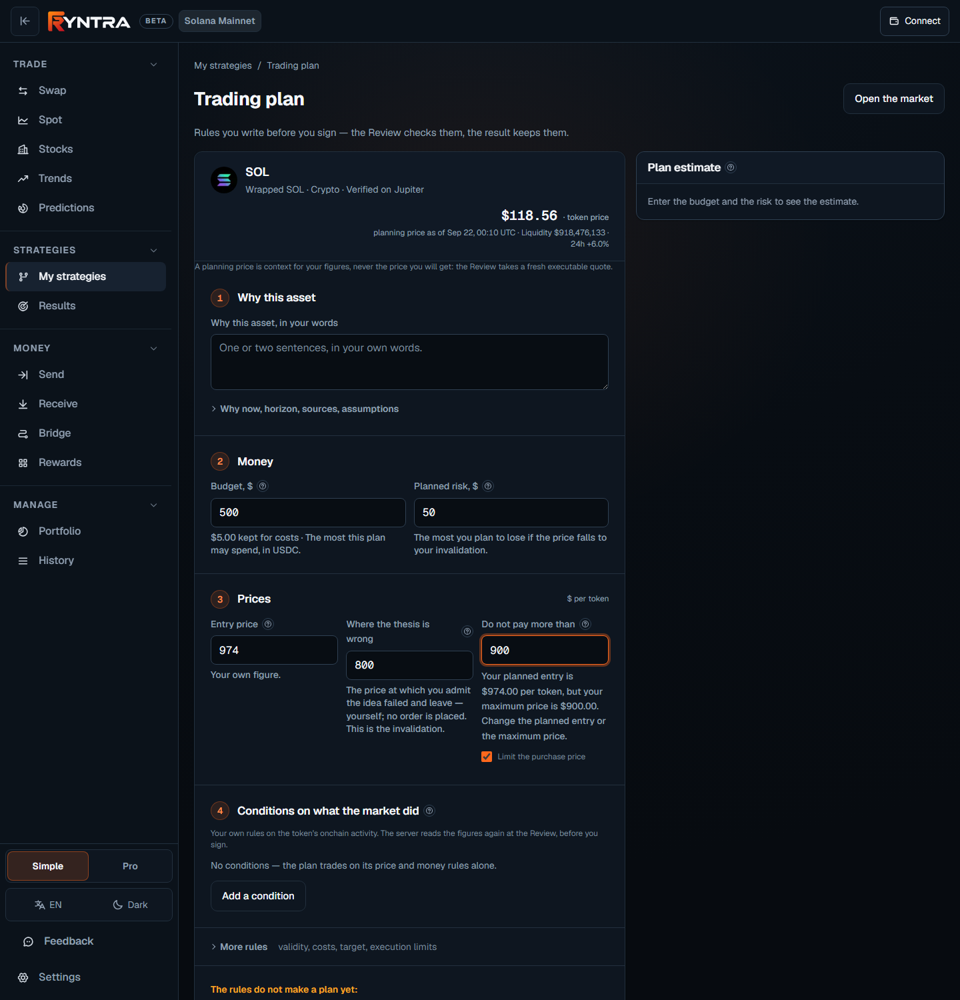

*The builder on SOL: the asset strip names the kind and the verification, the market indication with its time as planning context, the per-token prices and the estimate beside the form.*

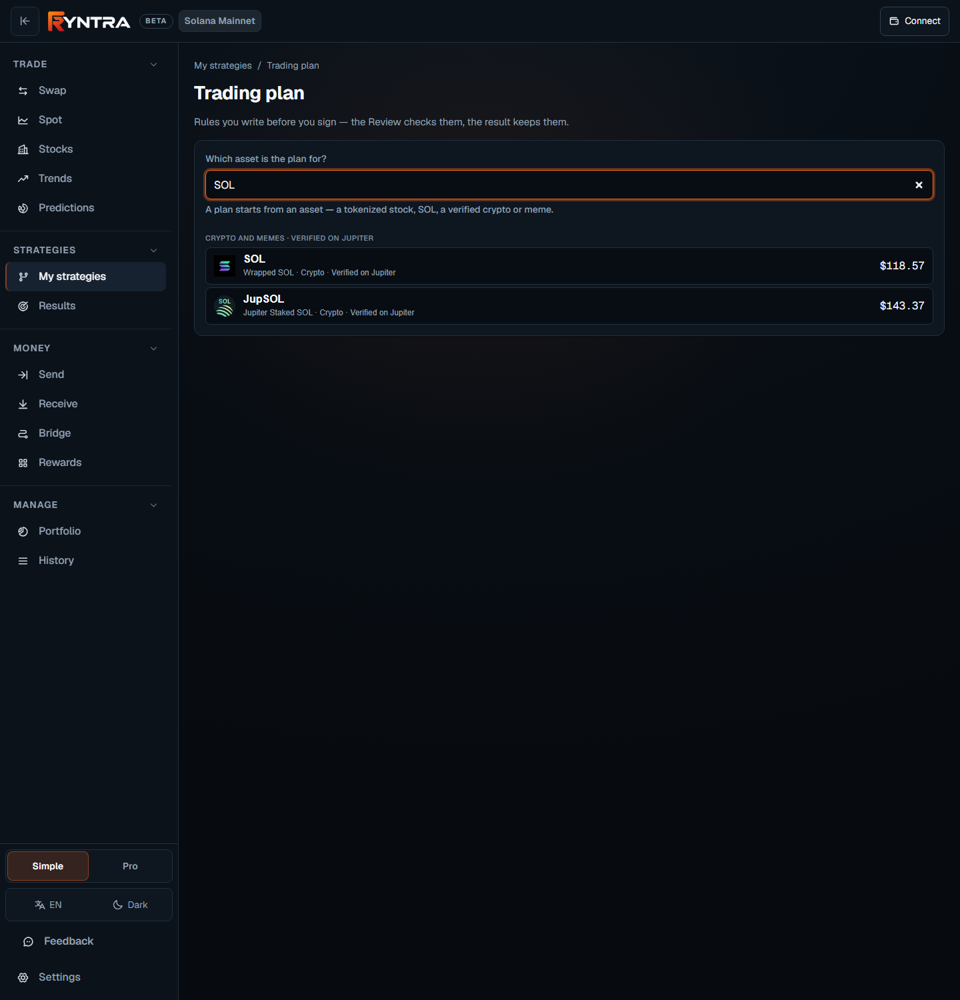

*One field over every asset a plan may name: the verified crypto and memes of the catalogue beside the tokenized stocks, each with its price.*

Open source in this repository: [`lib/plans/sizing.ts`](lib/plans/sizing.ts), [`packages/trading-plans/src/index.ts`](packages/trading-plans/src/index.ts).

Live: https://ryntra.io/app/strategies/new?mint=So11111111111111111111111111111111111111112

## Sep 17, 2026 — Predictions: markets on outcomes, with a plan, a Review and paper trading

**Predictions** · verified on the live product

A prediction market is a market on an outcome: a share of Yes pays $1 if it happens and $0 if not, so its price is the market's probability. Predictions lists these markets across the venues that trade them — the same question priced side by side — with search, trending, ending soon, the venues' own categories and a watchlist. A market opens into its outcomes and live probabilities, the day's change, the volume, the time to resolution, and one tap deeper into Research and Market depth. A Prediction Plan is written in three steps, a Review states what an order pays if right and loses if wrong, and the order goes to a paper account: simulated funds, no real money, the word paper everywhere.

- Discovery across venues: the question, the leading outcomes with their probabilities, the volume, the venues that trade it and the time to the end on every card; what moved since you watched it, and what needs attention.
- Research that keeps everything the aggregator gives and names its sources: each venue's live price, the price history, related markets, generated signals with the model named, the ripple effect, news, and each venue's own resolution rules.
- Market depth for those who want it: the aggregated order book with each level's venue breakdown, the books by venue, live trades, venue prices and the cross-venue return where one is computed.
- A Prediction Plan native to outcomes — thesis, outcome, amount, entry probability, an optional bound, invalidation, the resolution deadline, monitoring conditions — sized on the plain fact that the whole amount is the most you can lose.
- A Review before every paper order: the outcome, the amount, what it pays if right, what you lose if wrong, the fees, the quote's age, the venues, the settlement summary, the plan's conditions and every check; one action — Place paper order.
- Paper throughout: a paper balance, paper orders and paper positions on the account, shown apart from the real portfolio and tagged in History; live prediction trading is a separate decision that has not been taken.
- One account: enabling paper trading takes one signature with your wallet; the provider's session is held by the server behind your account and never reaches your browser.

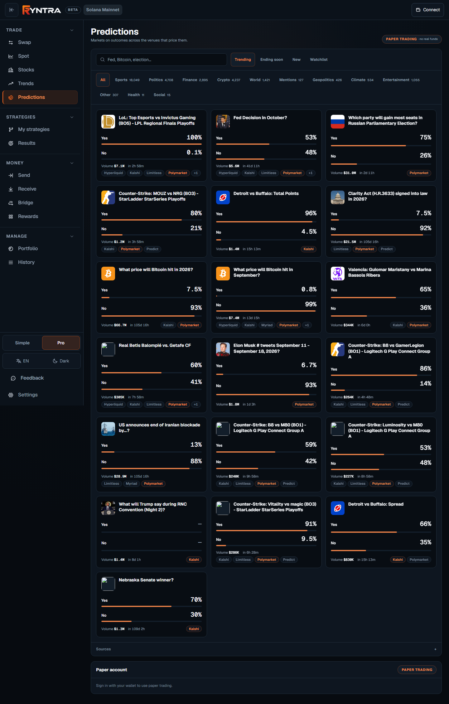

*The Predictions hub: search, trending, ending soon, the venues' own categories with their counts, and the cards — the question, the leading outcomes with their probabilities, the volume, the venues and the time to the end.*

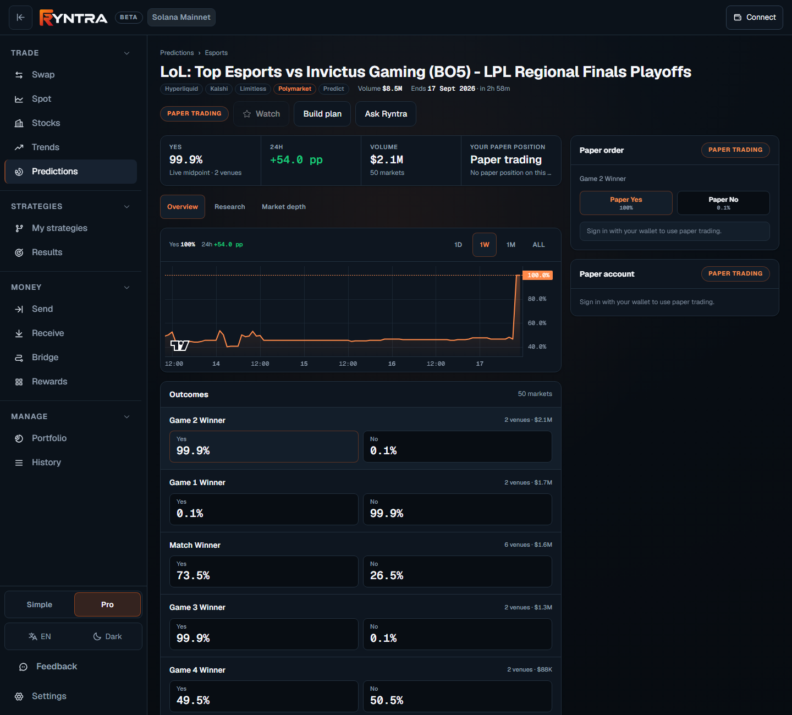

*A market: the outcome's live probability, the day's change, the volume, the paper position, the chart, the outcomes per market and the paper order ticket beside them — paper trading, said as such.*

Open source in this repository: [`lib/predictions/plan-model.ts`](lib/predictions/plan-model.ts), [`lib/predictions/failure.ts`](lib/predictions/failure.ts).

Live: https://ryntra.io/app/predictions

## Sep 16, 2026 — Risk & due diligence: how the token is built, as a rule of the plan

**Trading plans** · verified on the live product

A second evidence source answers a different question on the asset page — not what the market did, but how the token itself is built. Risk & due diligence reads it when you ask: the share the ten largest holders hold and how many addresses hold the token, whether the mint and freeze authorities are present or renounced, whether the token taxes every transfer, and what the source's early-holder labels hold now. Any of those facts can become a rule of the plan; at the Review the server reads the structure again and judges the rule beside the money checks. Before a transfer, Send shows what the same source knows about the recipient. No score, no verdict — the vocabulary has no word for safe.

- Four facts with their meaning, not a wall of fields: the top-ten share with the holder count, the mint authority, the freeze authority, the transfer tax; the early-holder labels as one line on a meme token and under Details elsewhere.
- An issuer-backed instrument is read in its own context: a supply held by the issuer's own accounts and a kept freeze right are the design of a tokenized stock, and the card says so beside the figure instead of dressing them as a warning.
- The state in the card's head counts facts — an authority present, a tax above zero — with no threshold behind any of them; a figure the source did not measure is a dash, never a zero.
- A rule on the structure: the top-ten share at most a bound you write, the transfer tax at most a percent, an authority renounced or present — required refuses the version when the fact is not as written or cannot be read.
- The Review names every source it read — when, how far behind it may be, whose data — and a plan without a structure rule, like every trade outside a plan, never waits on this source.
- The recipient check in Send: sanctions in the source's own words, findings as counts by severity, unsupported for a program, a vault or an exchange contract the source cannot analyse — never a verdict, never a block.
- Every call is reserved against a daily and a monthly ceiling and settled on the provider's own price; address lists never leave the adapter; @ryntra/evidence opens the second adapter with network-free tests.

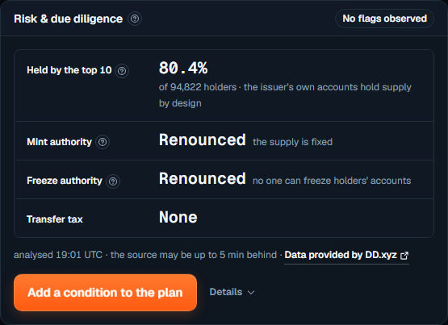

*The Risk & due diligence card after Check on a tokenized stock: the top-ten share with the issuer's context, both authorities renounced, no transfer tax, the source's analysis time and lag, and one press to add a condition.*

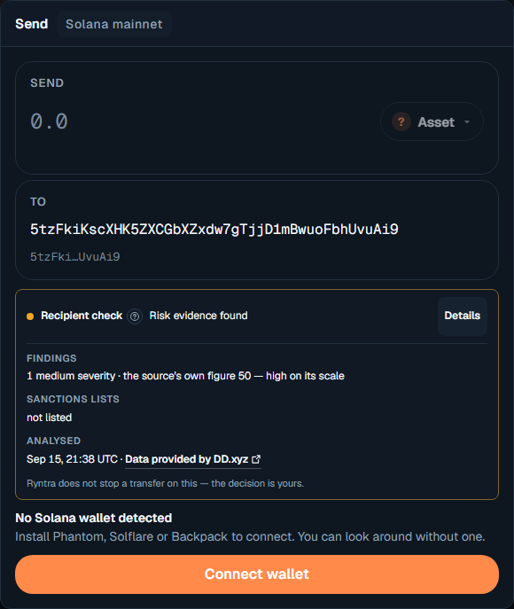

*The recipient check in Send: what an external security source found about the address, the sanctions screening in the source's own words, when it was analysed — and the line that the decision stays the person's.*

Open source in this repository: [`lib/evidence/metrics.ts`](lib/evidence/metrics.ts), [`lib/evidence/address.ts`](lib/evidence/address.ts), [`lib/evidence/flags.ts`](lib/evidence/flags.ts), [`lib/evidence/rights.ts`](lib/evidence/rights.ts), [`lib/evidence/providers/ddxyz/mapper.ts`](lib/evidence/providers/ddxyz/mapper.ts), [`packages/evidence/src/index.ts`](packages/evidence/src/index.ts).

Live: https://ryntra.io/app/stocks/NVDAx

## Sep 16, 2026 — Onchain evidence inside the trading plan

**Trading plans** · verified on the live product

A plan can now carry rules on what the market did, beside its price and money rules. On the asset page, Analysis reads a few figures from an external onchain source when you ask — the day's or the week's DEX trading volume with its buys and sells, the net movement of the token to or from the addresses the source labels as exchanges or as large holders — each with the time Ryntra asked, how far behind the source may be, and the source named. One press turns a figure into a condition of the plan; at the Review the server reads the figure again and judges the rule beside the checks on the money and the deal, keeps what it judged, and Results shows it beside the fill.

- Analysis on the asset page and in Spot: three facts on request, never on every row — the source is asked only when you ask, and a second reader within the window costs nothing.
- Every figure with its provenance: when Ryntra asked, how far behind the source may be, when the figures stop counting as current; a figure the source does not have is a dash, never a zero.
- Conditions in the plan builder, prefilled from the card with the figure as it stands; a labelled group's movement can warn but never refuse — a movement is not a trade and a label is not a person.
- The Review judges each condition on a fresh read before the signature; unmet, stale, unknown or unavailable is never a pass, so a rule that refuses also refuses when it cannot be judged.
- The plan page shows each condition against the figure now; Results shows what the Review knew before the signature, with the source's attribution beside it.
- Only the provider families its redistribution terms allow are called, with attribution; nothing restricted or prohibited is; every call is reserved against a credit ceiling and settled on the provider's own headers.
- The evidence layer is open source as @ryntra/evidence: the registry, the observation, the validator and the judge, the rights map, the governor contract and the adapter, with a live example under your own key.

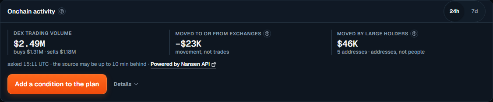

*The Onchain activity card after Analysis: the day's DEX trading volume with buys and sells, the movement to or from exchanges and by large holders, the time asked, the source's lag and attribution, and one press to add a condition.*

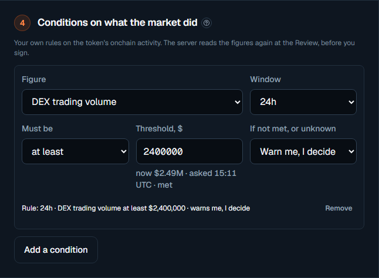

*A condition in the plan builder: the figure, the window, at least or at most, the threshold beside the figure as it stands now, and whether an unmet or unjudgeable rule warns or refuses the order.*

Open source in this repository: [`lib/evidence/metrics.ts`](lib/evidence/metrics.ts), [`lib/evidence/conditions.ts`](lib/evidence/conditions.ts), [`lib/evidence/rights.ts`](lib/evidence/rights.ts), [`packages/evidence/src/index.ts`](packages/evidence/src/index.ts).

Live: https://ryntra.io/app/stocks/NVDAx

## Sep 16, 2026 — Pre-IPO stock instruments

**Tokenized stocks** · verified on the live product

Tokens that give exposure to companies before an IPO joined the stock desk as their own instrument class, with PreStocks and Tessera as confirmed issuers. Each mint is checked against the issuer's own catalogue; the token is the unit, the issuer's own figures are shown as the issuer's mark and never as a market reference, the rights are stated in the issuer's words, and a token the issuer no longer supports is not offered for purchase.

- PreStocks and Tessera added as confirmed issuers; a token appears only when the issuer's catalogue lists its mint.
- Pre-IPO tokens priced per token, with the issuer's mark named as the issuer's mark — context, not a reference the plan checks against.
- Holder rights stated in the issuer's own terms on the asset page: price exposure through a holding entity, or a loan participation — not a share.
- The transfer fee a token's own mint withholds is read from the chain and shown inside the quote, never added twice.
- Token lifecycle from verified issuer notices: a conversion window with the issuer's cut-off, an expired token refused for purchase whatever a pool still quotes.
- A Pre-IPO filter in the screener and a same-company card that shows another issuer's token beside the one open — shown, not compared.
- A pricing defect fixed on the way: the list had divided a scaled-unit price by the multiplier a second time.

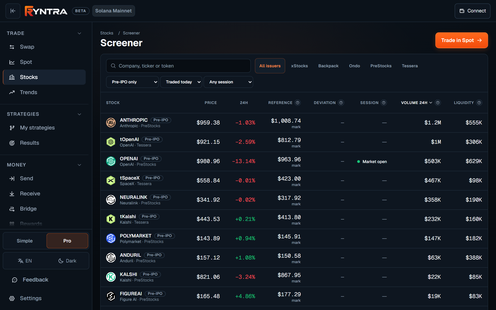

*The screener on Pre-IPO only: issuer tabs, the issuer's mark labelled as such where a market reference would stand, the exchange session, the traded volume.*

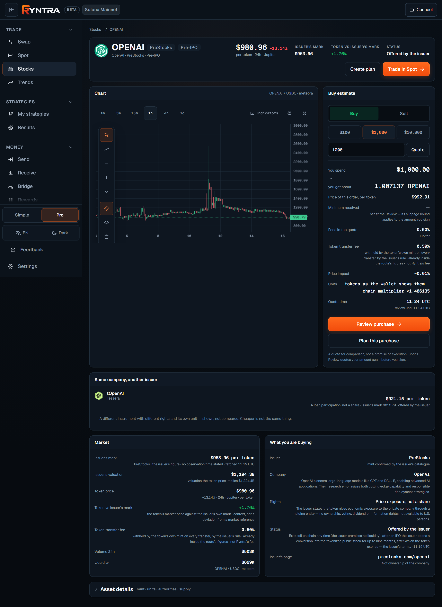

*A pre-IPO asset page: the price per token, the issuer's mark and the premium to it, the transfer fee the mint withholds inside the estimate, the rights in the issuer's words, the token's status with the issuer.*

Open source in this repository: [`lib/stocks/instrument.ts`](lib/stocks/instrument.ts), [`lib/stocks/lifecycle-events.ts`](lib/stocks/lifecycle-events.ts), [`lib/stocks/units.ts`](lib/stocks/units.ts).

Live: https://ryntra.io/app/stocks/screener?kind=preipo

## Sep 16, 2026 — The plan builder in three steps

**Trading plans** · verified on the live product

The Trading Plan builder was reordered into the three questions a person actually answers — why this stock, how much money, at what prices — with every other rule behind one disclosure and a sensible default. Numbers are read the way they were typed, the estimate updates as you type, and the plan states its own unit.

- Three steps: the thesis in your words, the budget and planned risk, the entry and the price where the thesis is wrong.
- Costs, validity, target and execution limits behind “More rules”, each with a default that holds.
- A number typed with a comma, a space or a currency sign is read as the person meant it; an empty field is never zero.
- The entry prefilled from the market; a pre-IPO plan says it is priced per token and that the issuer's mark is not a market reference.
- The plan estimate — units, notional, modelled loss at the invalidation — computed as you type, with its assumptions beside it.

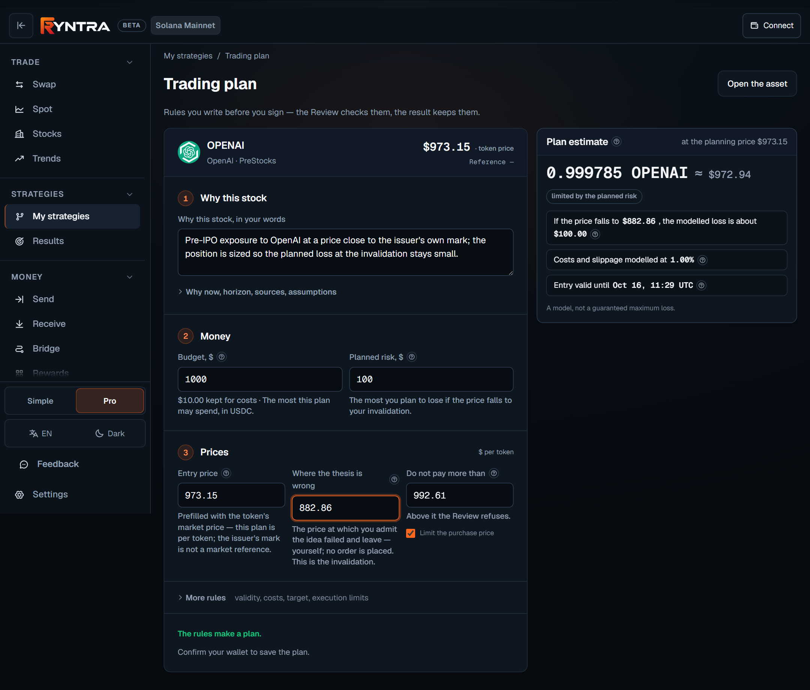

*The plan builder in three steps with the estimate computed beside it: units, the modelled loss at the invalidation, the costs modelled, the entry's validity.*

Open source in this repository: [`lib/plans/decimal-input.ts`](lib/plans/decimal-input.ts), [`lib/plans/sizing.ts`](lib/plans/sizing.ts).

Live: https://ryntra.io/app/strategies/new

## Sep 16, 2026 — Operations ledger behind the public statistics

**Analytics** · verified on the live product

The public statistics page now reads Ryntra's own ledger of confirmed operations: a row appears the moment an operation confirms, nothing is estimated, and the subset that can be proven independently on Solana is shown as its own figure, verified transaction by transaction against public chain data.

- Executed volume, operations, wallets and gross fees from the ledger, filterable by product and period.
- Every operation links to the transaction that proves it; the on-chain verified count is stated beside the total.
- Two numbers kept distinct on purpose: all confirmed operations, and the on-chain attributable subset.
- A public dashboard of the attributable subset, built from the same rule, linked from the page.

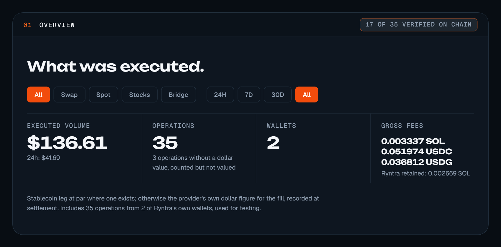

*The overview of the public statistics: executed volume, operations, wallets and gross fees by product and period, with the number verified on chain beside the total.*

Live: https://ryntra.io/stats

## Sep 15, 2026 — Trading plans bound to the deal

**Trading plans** · verified on the live product

A Trading Plan is a set of rules a person writes before they sign: the thesis, the money, the entry, the invalidation, the exit. The plan now lives on the server with versions, its size is computed deterministically from the rules, and the pre-signature Review judges the exact order against the plan before the wallet signs.

- Plan versions stored per wallet; the builder and the plan detail under My strategies.
- Deterministic sizing: units limited by the planned risk or by the budget net of costs, with the assumptions the figure stands on.
- The Review's Strategy block checks the order against the plan — the entry bound, the budget, the planned risk, the reference deviation — and says which rule refused.
- Plan versus actual: the result of a plan recorded from what was executed, kept with the plan.

Open source in this repository: [`lib/plans/sizing.ts`](lib/plans/sizing.ts).

Live: https://ryntra.io/app/strategies

## Sep 15, 2026 — Deal terms and token alternatives on the asset page

**Tokenized stocks** · verified on the live product

The asset page states the terms of your deal for the amount you type — what you spend, what you receive, the price per share, the fees inside the quote, the price impact — and compares the confirmed tokens of the same underlying side by side: the same amount, the same settlement asset, the same side, quoted together.

- Buy and Sell estimates for a typed amount, with the minimum received set at the Review rather than promised here.
- Per-share prices through each token's own multiplier, so tokens with different scaling compare on one basis.
- The comparison names the issuer of each token and says plainly that cheaper is not the same rights or less risk.
- One click into the same Spot ticket or the same plan builder for the token chosen.

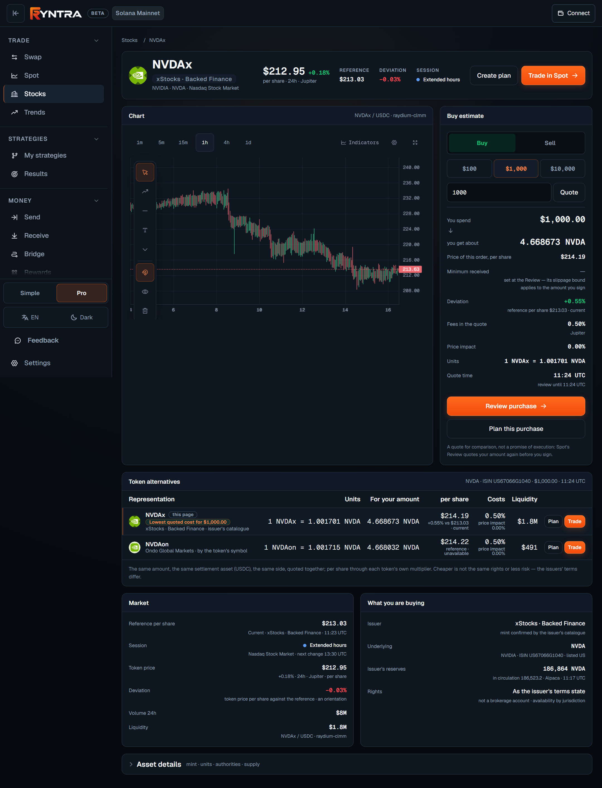

*A listed-equity asset page: the reference price, the deviation and the session; the estimate per share through the token's multiplier; the confirmed tokens of the same company quoted for the same amount.*

Open source in this repository: [`lib/stocks/units.ts`](lib/stocks/units.ts).

Live: https://ryntra.io/app/stocks/NVDAx

## Sep 15, 2026 — A versioned API contract for native clients

**Platform** · shipped

Ryntra's native client and the web application now share one versioned contract: a wallet signs in and receives a bearer session, capabilities are discovered rather than assumed, and the watchlist, search, candles, Trading Plans and their Review block are one shape for both clients.

- Sign-in with Solana into a bearer session; capabilities announced by version.
- The watchlist with one merge rule, search and candle limits stated in the contract.
- Version 1.1.0 adds the Trading Plan, its Review block, its execution binding and a device registry.
- Android app links declared so the native client can open Ryntra addresses directly.

Live: https://ryntra.io/docs

## Sep 15, 2026 — The stock desk: Discover, the screener, one shared universe

**Tokenized stocks** · verified on the live product

The stock desk became a page of its own: Discover with its collections, a screener with search and issuer tabs, and one universe of confirmed tokens shared across server instances and streamed behind the page's own skeleton so the list never arrives half full.

- Collections — most traded, most liquid, gainers, losers — each with the rule it is built on.
- Search by company, ticker or token; tabs per issuer; filters by session and by what traded today.
- Provider budget respected: background reads wait their turn, a quote asks once more, and a partial universe is never kept.
- A market reference stated for US-listed underlyings whose issuer publishes none, when a price feed is available for it.

Open source in this repository: [`lib/stocks/session.ts`](lib/stocks/session.ts).

Live: https://ryntra.io/app/stocks

## Sep 14, 2026 — Tokenized stocks on Solana

**Tokenized stocks** · verified on the live product

Stocks arrived as a first-class market: tokens confirmed against the issuers' own catalogues, the issuer's reference price and the exchange session beside the token's market price, units read from the chain's own multiplier, and a quote that knows the size it is quoting.

- Confirmed representations from xStocks, Backpack and Ondo catalogues; a token the issuer does not list is not a stock here.
- The issuer's reference price and the exchange session, with the state of the reference — current, last available, stale — never promoted.
- Units from the chain: the Scaled UI Amount multiplier turns a raw balance into the shares a holder economically owns, computed with integers.
- A size-aware quote per share and the deviation from the reference, stated as a fact about this quote at this time.

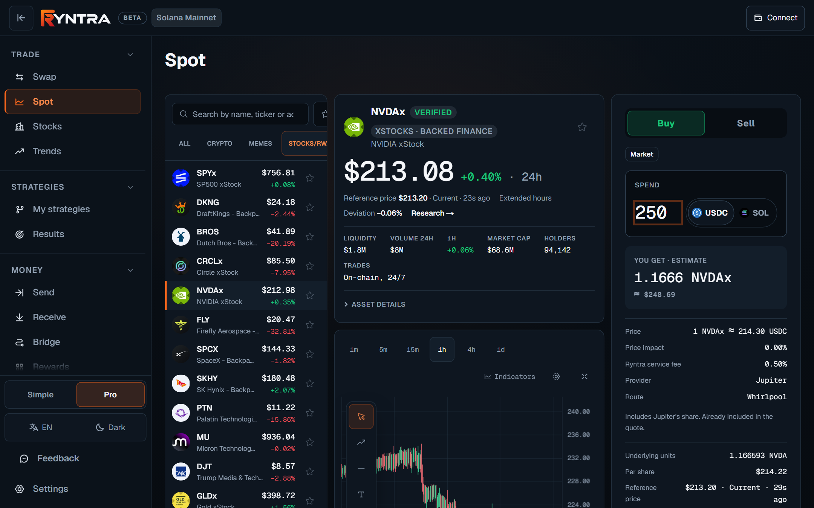

*The Spot terminal on a tokenized stock: the reference price and its state, the deviation, and a quote naming the provider, the route, the service fee and the underlying units behind the token amount.*

Open source in this repository: [`lib/stocks/units.ts`](lib/stocks/units.ts), [`lib/stocks/session.ts`](lib/stocks/session.ts), [`lib/stocks/instrument.ts`](lib/stocks/instrument.ts).

Live: https://ryntra.io/app/stocks

## Sep 14, 2026 — Public site, documentation and one navigation

**Platform** · verified on the live product

The public site became the front door of the product, the documentation describes the product that exists, and the landing and the application share one header, one footer, one language control and one theme.

- A new landing at ryntra.io showing the product itself, live, with the application one click away.
- Product documentation, the security statement and the policies at ryntra.io/docs, generated from the same facts the product runs on.
- One menu on every public page; English and Ukrainian; dark and light.
- The application's navigation reorganised: Stocks a page of its own, Bridge under Money, History where the operations are.

Live: https://ryntra.io/docs

## Sep 14, 2026 — Evidence kit 1.1.0

**Evidence kit** · shipped

The open-source Solana evidence kit in this repository moved to a neutral evidence envelope shared by every module, and its boundary verifier was hardened so that a file nobody listed, a sensitive filename in any path segment or a dependency outside the public registry fails the build.

- The evidence envelope generalised; public JSON formats, hashes and signatures unchanged.
- The boundary verifier refuses sensitive filenames in every path segment and requires every dependency to resolve from the public npm registry.
- The CLI's JSON verification exit status fixed earlier in the month: tampered or unrecognised receipts exit with code 2.

Open source in this repository: [`lib/evidence/envelope.ts`](lib/evidence/envelope.ts), [`scripts/verify-boundaries.mjs`](scripts/verify-boundaries.mjs), [`examples/solana-evidence-cli/cli.ts`](examples/solana-evidence-cli/cli.ts).

Live: https://ryntra.io/docs

## Sep 12, 2026 — Spot fills, and the Portfolio as a statement

**Trading** · verified on the live product

Every Spot market trades, a fill reads as a fill, balances stay true after an operation, and the account pages read the way a broker's statement does: Activity as a statement of operations, Portfolio as holdings with their value, Rewards as one composed page.

- Spot: every listed market executes on the same engine Swap uses; the coin is shown where the person looks.
- Balances refreshed truthfully after a swap; a swap reads as a swap.
- Activity as a statement; Portfolio as a broker shows it; the top bar carries one principal.

Live: https://ryntra.io/app/spot

## Sep 11, 2026 — The Spot terminal, and the wallet as the account

**Trading** · verified on the live product

One market terminal for Solana — Crypto, Memes and Stocks/RWA inside it — on the engine Swap already ran on, with a chart that is the market and a rate stated per mechanism. The same day the wallet became the account: no separate sign-up, Telegram an optional notification channel, and Ryntra Points inside Rewards.

- Spot terminal: market list, chart, ticket and asset details in one screen, columns that follow the screen size.
- The wallet is the account; Telegram connected from Settings as a notification channel only.
- Bridge extended to four more networks, each measured against its provider before being written down; a receipt for every bridge transfer.
- Ryntra Points inside Rewards; the brand identity applied across the product in dark and light.

Live: https://ryntra.io/app/spot

## Sep 10, 2026 — One service fee, and Rewards

**Trading** · verified on the live product

The service fee became one number — fifty basis points, taken through each provider's own fee mechanism and shown inside the quote — and Rewards opened: a share of the fee actually collected goes back to the people who brought the trader, claimable from one dollar.

- A 0.50 % service fee on swaps, collected through the provider's own pipe and already included in the quote shown.
- Rewards: 50 / 10 / 5 per cent of the fee actually collected shared across three levels of inviters; an inviter is chosen by the person, not assigned.
- The swap card shows what an amount is worth before it is signed; Swap became the front door of the application.

Live: https://ryntra.io/app/rewards

## Sep 7, 2026 — Unified Swap

**Trading** · verified on the live product

One swap form over three execution providers — Jupiter on Solana, Circle CCTP for USDC between Solana and Base, and Mayan for cross-chain routes — with one ticket, one network and asset selector, and a payment request that travels as a link.

- One form; the route chosen by what the person asks for, the provider named on the ticket.
- A segmented network · asset selector, one popover, 25 / 50 / 75 / MAX.
- Public payment requests as shareable links.

Live: https://ryntra.io/app/swap

## Sep 4, 2026 — One product shell

**Platform** · verified on the live product

The application became one product with six domains that fill the screen they are given, one wallet context asked for once, account and wallet as two distinct principals, and a public site that shows the product rather than describing it.

- Six domains under one shell; Home at the root; the network no longer changes when the domain does.
- One wallet context, never asked twice; account and wallet as two chips because they are two principals.
- The public product page and product map projected from the product itself; the Asset Passport at its own address.

Live: https://ryntra.io/app

## Sep 1, 2026 — USDC between Solana and Base through Circle CCTP

**Trading** · verified on the live product

A bridge for USDC between Solana and Base on Circle's CCTP, built as one card for a transfer that crosses two chains: plan, burn, attestation, mint, observation and recovery, with a signed receipt and the public verifier run against it. Opened after a real two-dollar transfer was signed and matched end to end.

- The execution path in the open: burn on the source chain, Circle's attestation, mint on the destination, independent read-back.
- A transfer survives a closed tab and resumes where it stood; waiting for Circle needs no button.
- Standard against Fast, both fees and the cost on Base shown in the Review before the signature.
- The direction travels with the transfer; the bridge runs both ways.

Live: https://ryntra.io/app/bridge

## Aug 29, 2026 — Send, and the pre-signature Review

**Risk review** · verified on the live product

Send on Solana mainnet with a Review before every signature: each token's capabilities read from its mint, safe recipients resolved, the exact fee, rent and simulation shown, a one-shot submit boundary, independent recovery and read-back, and a receipt retained for every transfer.

- Token capabilities classified from the mint's own extensions; a transfer that the token cannot clear is refused before it is built.
- The Review states the exact fee, the rent a new account costs and the simulation result before the wallet is asked to sign.
- Submit once: a signed transfer is not lost when the tab reloads, and recovery waits on the person's behalf.
- Receipts shown and retained; the swap gained the same order, execute and signed-receipt path the same week.

Open source in this repository: [`lib/solana/preflight.ts`](lib/solana/preflight.ts), [`lib/solana/receipt.ts`](lib/solana/receipt.ts).

Live: https://ryntra.io/app/send

## Aug 26, 2026 — Evidence kit 1.0.0 published

**Evidence kit** · shipped

The read-only Solana evidence kit was published in this repository under Apache-2.0: asset passports for Token-2022 mints, transfer preflight against a declared owner policy, offline receipt verification, a typed SDK, an MCP server, JSON Schemas and a CLI.

- Everything read-only by construction: no transaction is built, no key is held, and the boundary test proves it from the shipped sources.
- The same modules the product runs on, imported rather than copied.

Open source in this repository: [`packages/solana-evidence-sdk/src/index.ts`](packages/solana-evidence-sdk/src/index.ts), [`packages/solana-evidence-mcp/src/server.ts`](packages/solana-evidence-mcp/src/server.ts), [`examples/solana-evidence-cli/cli.ts`](examples/solana-evidence-cli/cli.ts).

Live: https://ryntra.io
