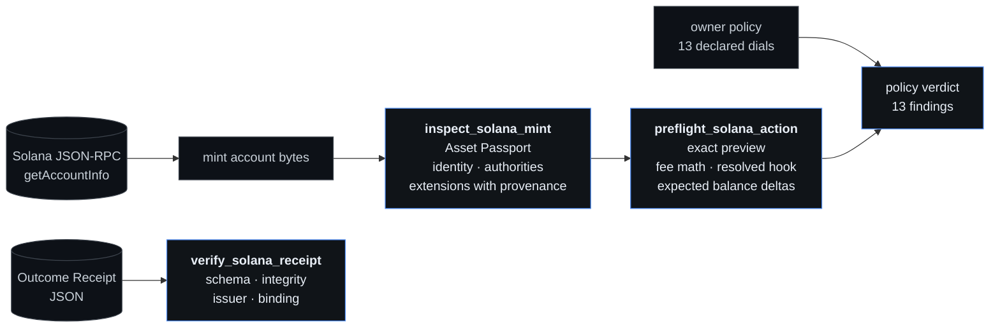

# Ryntra Solana Evidence Kit

**Read what a Solana asset can do to you, preview exactly what a transfer will
do, and check a receipt without asking the party that wrote it.**

Apache-2.0. Read-only by construction: no key, no signing path, no transaction
building, and one RPC method — `getAccountInfo`. A test enumerates every RPC
call and every signing-shaped identifier in the shipped sources on each run, so
that sentence is a gate rather than a promise.

```bash
npm ci
npm run verify        # lint, typecheck, network-free tests, boundary gate
npm run cli -- inspect 2b1kV6DkPAnxd5ixfnxCpjxmKwqjjaYmCZfHsFu24GXo
```

That last command reads PayPal USD on mainnet through a public endpoint, with no
account anywhere, and prints its eight token extensions with what each one means
for somebody holding the asset.

## Why

A Token Extensions mint can carry powers a balance does not show you. A
permanent delegate lets the issuer move or burn tokens from any account. A
transfer hook runs somebody else's program on every transfer. A transfer fee
means the recipient gets less than was sent. A default-frozen account state
means receiving a token is not the same as being able to move it.

None of that is hidden — it is on chain, in the mint account, decodable by
anyone. It is just not *read* by most of the things people press buttons in.

This kit reads it, says what it means in a sentence a holder understands, and
refuses to compress any of it into a score. There is no rating here, and the
best verdict the policy engine can return is `NO_KNOWN_BLOCKER`.

## The three tools



| | What it answers | Reaches the network |
|---|---|---|
| `inspect_solana_mint` | What is this asset, and what can its issuer do to a holder | yes, one read |
| `preflight_solana_action` | What will this exact transfer do, and what does my policy make of it | yes, one read |
| `verify_solana_receipt` | Is this receipt intact, who signed it, and is it about Solana | no — entirely local |

Each is available three ways: as a typed SDK call, as an MCP tool, and from the
CLI.

## Layout

```
lib/solana/          the evidence core — decoding, passport, preflight, policy, receipt
lib/agent-control/   the frozen canonical hashing and the Solana registry adapter
lib/guard/           the one canonical JSON serializer both hashers use
packages/solana-evidence-sdk/   typed calls over the core
packages/solana-evidence-mcp/   local stdio MCP server
examples/solana-evidence-cli/   the runnable CLI
docs/solana/schemas/            published JSON Schemas for non-JS consumers
```

`lib/` is not a copy. These are the same modules ryntra.io runs, extracted with
their paths intact — so a result from this kit and a result from the product
come from the same code, and an extraction that broke that fails its own tests.
`lib/stellar/evidence.ts` is here for the same reason and no other: the evidence
envelope is chain-neutral, and shipping the one implementation beats shipping a
copy that drifts. `lib/solana/evidence.ts` says so where you meet it.

## Design rules, and what they cost

**Every fact carries how it is known.** `ONCHAIN_VERIFIED`, `DECLARED`,
`DERIVED`, `CONFLICTING`, `UNKNOWN`, `UNSUPPORTED`. A value with no source is
not a value here. The cost is verbosity, and it is worth it: an issuer's own
marketing and a ledger read must never wear the same badge.

**A sentence describes the setting, not the slot.** A mint carrying
`TransferHook` with the all-zero program id has no hook installed — the passport
says that, and says who can install one. The generic sentence would have been
false on the single most-inspected Token Extensions mint there is.

**Amounts are raw base units as strings.** A 64-bit amount does not survive a
JavaScript number, and a lossy amount is a wrong amount. There is no decimal
anywhere on the value path.

**An extension nobody wrote semantics for still renders**, flagged, with its raw
kind. A decoded fact without a pretty sentence is still a fact; hiding it would
be the lie.

**Nothing throws.** Refusals are values with a code and a reason —
`ACCOUNT_NOT_FOUND`, `NOT_A_MINT`, `DECODE_FAILED`. "No answer" and "this
answer" must not look alike.

**Retries cover the transport and never the answer.** A response that parses is
returned as-is, including "no account", because re-asking does not change facts.

## Receipts

A Ryntra Outcome Receipt is an observation of something that already happened —
never an instruction, and never proof that Ryntra did it. `verify_solana_receipt`
recomputes both hashes from the receipt's own bytes and checks the Ed25519
signature against the key the receipt carries. Four axes, reported separately:

- **schema** — is this the shape of a receipt at all;
- **integrity** — do both hashes recompute;
- **issuer** — is the signature sound; and, only if you pass `trustedPublicKeys`,
  is the key one *you* trust;
- **binding** — does the registry pin name the Solana adapter.

"Signed by someone" is not "signed by Ryntra", and collapsing the two is the
mistake that axis exists to prevent. `lib/solana/fixtures/receipt-*.json` are
real artifacts you can run this against, including one that is the signed one
with a single character edited.

## Trust boundary

- **Non-custodial and keyless.** No key is held, read, derived or requested.
  There is no signing path, and the boundary gate fails the build if one appears.
- **Nothing is executed.** No transaction is built or submitted.
- **A verdict is not a safety judgement.** It reports the absence of known
  blockers under a policy the caller declared, and the verdict vocabulary has no
  word for safety.
- **The endpoint is the operator's choice.** No tool or SDK call takes a URL
  from its caller; provider endpoints come from `RYNTRA_SOLANA_RPC_MAINNET` and
  `RYNTRA_SOLANA_RPC_DEVNET`, and public defaults work with no account.
- **Source-distributed.** The root package is `private`, so an accidental
  `npm publish` refuses. No npm package is claimed.

## Links

- SDK: [`packages/solana-evidence-sdk`](packages/solana-evidence-sdk/README.md)
- MCP server: [`packages/solana-evidence-mcp`](packages/solana-evidence-mcp/README.md)
- CLI: [`examples/solana-evidence-cli`](examples/solana-evidence-cli/README.md)
- Security: [SECURITY.md](SECURITY.md) · Contributing: [CONTRIBUTING.md](CONTRIBUTING.md)
- The workspace this came from: <https://ryntra.io/solana>
