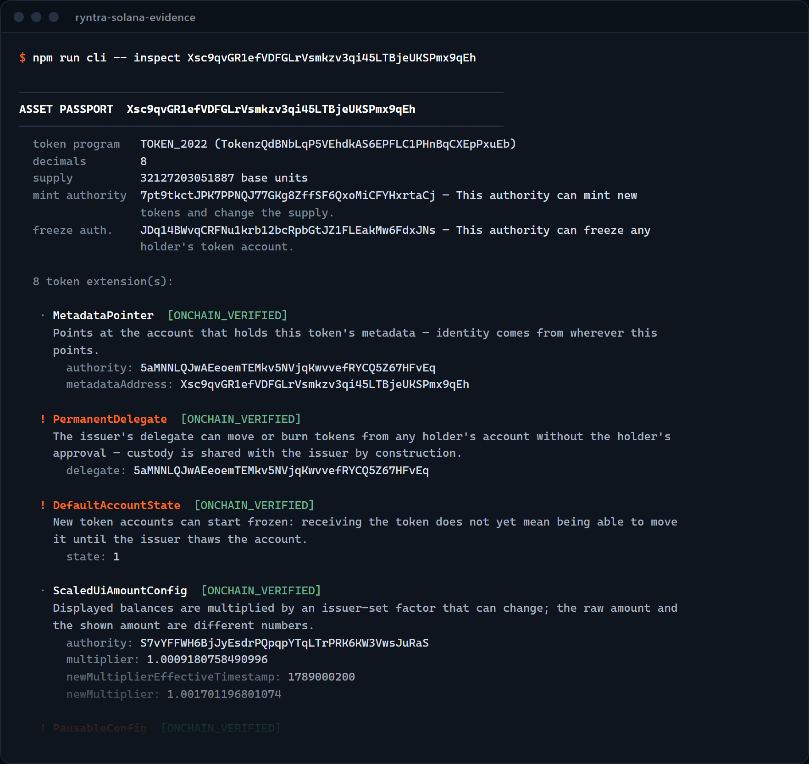
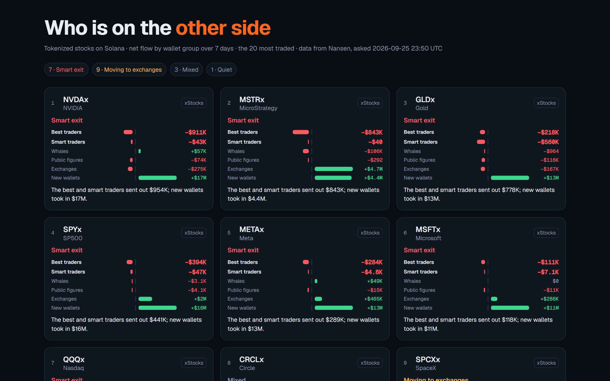

# Ryntra Solana Evidence Kit

[](https://github.com/ryntra-io/ryntra-solana-evidence/actions/workflows/ci.yml)
[](LICENSE)

Read-only TypeScript tools for developers building on tokenized stocks and
other Token-2022 assets on Solana: see what a mint lets its issuer do, check a
transfer against your own policy and verify a receipt offline — with no wallet
and no key.

**Used in production by [Ryntra](https://ryntra.io/app)** — invest in tokenized
stocks from $1, in your own wallet, on Solana.

[SDK](packages/solana-evidence-sdk/README.md) ·
[MCP server](packages/solana-evidence-mcp/README.md) ·
[CLI](examples/solana-evidence-cli/README.md) ·
[Tokenized stocks](packages/tokenized-stocks/README.md) ·
[Build log](BUILDLOG.md)

<a name="try-it-in-30-seconds"></a>

## Quick start

Node.js 24, no wallet and no API key. Read NVIDIA's xStock (NVDAx) straight
from Solana mainnet through a public RPC:

```bash
git clone https://github.com/ryntra-io/ryntra-solana-evidence.git
cd ryntra-solana-evidence
npm ci
npm run cli -- inspect Xsc9qvGR1efVDFGLrVsmkzv3qi45LTBjeUKSPmx9qEh
```



Every `!` is a power that can change the outcome of a transfer. For this token
the issuer's delegate can move or burn any holder's tokens, new accounts can
start frozen, the whole token can be paused, and the balance a wallet shows is
the raw amount times a multiplier the issuer sets. Add `--json` for the
machine-readable passport, or inspect Apple's xStock,
`XsbEhLAtcf6HdfpFZ5xEMdqW8nfAvcsP5bdudRLJzJp`. A public RPC can be slow or
rate-limited; the [connection options](packages/solana-evidence-sdk/README.md#connection)
point the kit at your own provider.

<details>
<summary>The whole passport as text</summary>

```text
────────────────────────────────────────────────────────────────────────
ASSET PASSPORT  Xsc9qvGR1efVDFGLrVsmkzv3qi45LTBjeUKSPmx9qEh
────────────────────────────────────────────────────────────────────────
  token program   TOKEN_2022 (TokenzQdBNbLqP5VEhdkAS6EPFLC1PHnBqCXEpPxuEb)
  decimals        8
  supply          32127203051887 base units
  mint authority  7pt9tkctJPK7PPNQJ77GKg8ZffSF6QxoMiCFYHxrtaCj — This authority can mint new tokens and change the supply.
  freeze auth.    JDq14BWvqCRFNu1krb12bcRpbGtJZ1FLEakMw6FdxJNs — This authority can freeze any holder's token account.

  8 token extension(s):

   · MetadataPointer  [ONCHAIN_VERIFIED]
     Points at the account that holds this token's metadata — identity comes from wherever this points.
       authority: 5aMNNLQJwAEeoemTEMkv5NVjqKwvvefRYCQ5Z67HFvEq
       metadataAddress: Xsc9qvGR1efVDFGLrVsmkzv3qi45LTBjeUKSPmx9qEh

   ! PermanentDelegate  [ONCHAIN_VERIFIED]
     The issuer's delegate can move or burn tokens from any holder's account without the holder's approval — custody is shared with the issuer by construction.
       delegate: 5aMNNLQJwAEeoemTEMkv5NVjqKwvvefRYCQ5Z67HFvEq

   ! DefaultAccountState  [ONCHAIN_VERIFIED]
     New token accounts can start frozen: receiving the token does not yet mean being able to move it until the issuer thaws the account.
       state: 1

   · ScaledUiAmountConfig  [ONCHAIN_VERIFIED]
     Displayed balances are multiplied by an issuer-set factor that can change; the raw amount and the shown amount are different numbers.
       authority: S7vYFFWH6BjJyEsdrPQpqpYTqLTrPRK6KW3VwsJuRaS
       multiplier: 1.0009180758490996
       newMultiplierEffectiveTimestamp: 1789000200
       newMultiplier: 1.001701196801074

   ! PausableConfig  [ONCHAIN_VERIFIED]
     The issuer can pause the whole token: while paused, transfers stop for every holder at once.
       authority: JDq14BWvqCRFNu1krb12bcRpbGtJZ1FLEakMw6FdxJNs
       paused: false

   ! ConfidentialTransferMint  [ONCHAIN_VERIFIED]
     Confidential transfers are configured: amounts can move encrypted, under the issuer's auditor settings.
       authority: 5aMNNLQJwAEeoemTEMkv5NVjqKwvvefRYCQ5Z67HFvEq
       autoApproveNewAccounts: false
       auditorElgamalPubkey: null

   ! TransferHook  [ONCHAIN_VERIFIED]
     No transfer-hook program is set, so nothing extra runs on a transfer today; the hook authority can install one, and it would then run on every transfer.
       authority: 5aMNNLQJwAEeoemTEMkv5NVjqKwvvefRYCQ5Z67HFvEq
       programId: 11111111111111111111111111111111

   · TokenMetadata  [ONCHAIN_VERIFIED]
     Name, symbol and URI are stored on the mint itself and controlled by the metadata update authority.
       updateAuthority: 5aMNNLQJwAEeoemTEMkv5NVjqKwvvefRYCQ5Z67HFvEq
       mint: Xsc9qvGR1efVDFGLrVsmkzv3qi45LTBjeUKSPmx9qEh
       name: NVIDIA xStock
       symbol: NVDAx
       uri: https://xstocks-metadata.backed.fi/tokens/Solana/NVDAx/metadata.json

   ! marks an extension that can change the outcome of a transfer.

  read 2026-09-28T17:25:28.257Z from Solana mainnet JSON-RPC (solana-rpc.publicnode.com)

────────────────────────────────────────────────────────────────────────
  READ-ONLY EVIDENCE — NOT A WALLET AND NOT AN EXECUTOR
  No key is held, no transaction is built or signed, and no state-changing RPC method is called.
  A policy verdict reports the absence of known blockers under a declared policy. It is not a safety judgement and endorses nothing.
────────────────────────────────────────────────────────────────────────
```

</details>

## What works

| Capability | Output | Network access |
|---|---|---|
| Mint inspection | Asset identity, authorities and SPL / Token-2022 extension data with provenance | Read-only Solana RPC |
| Transfer preflight | Mint-based fee calculations, structural constraints and a verdict against the declared owner policy | Read-only Solana RPC |
| Receipt verification | Separate schema, integrity, issuer-signature and Solana-binding results | None |
| Tokenized-stock model | Instrument class, unit basis and rights; the Token-2022 transfer fee from a mint's config; a token's issuer lifecycle; scaled-unit arithmetic; the state of a reference price against a session | None |
| Trading-plan helpers | Deterministic position sizing with its assumptions; decimal input read as typed | None |
| Evidence layer | A metric registry, a normalized onchain observation with its times and attribution, a condition validator and judge where an unjudgeable rule is never a pass, a rights map read from the provider's terms, and the Nansen adapter that reserves and settles every call | Nansen API, read-only, only through the adapter with your own key |
| Stock flows | Who moved each tokenized stock over 7 days or 24 hours, by Nansen's wallet groups; a verdict per stock; BUY or WAIT before a purchase | Nansen API with your own key; Ryntra's public universe without a key |

The first three are available through the typed SDK, local stdio MCP server and
CLI. The MCP server also exposes an editable example owner policy.
[Four JSON Schemas](docs/solana/schemas) describe asset passports, owner policies,
policy verdicts and transfer preflights. The two model packages are plain
TypeScript modules with tests.

## More to try

### Check a receipt offline

```bash
npm run cli -- verify lib/solana/fixtures/receipt-solana-matched-signed.json --json
```

The sample is a test fixture, not evidence of a customer's transaction.
Try `receipt-solana-tampered.json` in the same directory to see integrity
verification fail with exit code `2`.

### Who is on the other side — with a Nansen key

Before you buy a tokenized stock on Solana, see who is selling it to you.
[`examples/stock-flows`](examples/stock-flows/README.md) reads Nansen's flow
intelligence for the most traded tokenized stocks — xStocks, PreStocks, Ondo and
Backpack tokens — ranks them by what the best and smart traders are doing, and
answers **BUY or WAIT** before a purchase, with its reason and an exit code a
script can act on. It needs your own Nansen API key.

```bash
export NANSEN_API_KEY=<your key>
node examples/stock-flows/radar.ts                  # the board, 20 credits
node examples/stock-flows/radar.ts guard NVDAx      # BUY or WAIT, 2 credits
```



## Verify the kit

```bash
npm run verify
```

Verification runs lint, type checking, network-free tests of every package
and the boundary checks. [GitHub Actions](https://github.com/ryntra-io/ryntra-solana-evidence/actions)
runs the same command for changes to `main` and pull requests.

## Ryntra product development

Ryntra is developed in a private production repository. This public repository
contains selected open-source components, public technical interfaces and a
sanitized record of shipped product development:

- **[BUILDLOG.md](BUILDLOG.md)** — what shipped in the product and when, newest
  first, with screenshots of the live application. Generated from structured
  entries and published with each meaningful slice of work.
- **[docs/product](docs/product/README.md)** — how the product works today:
  [trading](docs/product/trading.md), [tokenized stocks](docs/product/tokenized-stocks.md),
  [trading plans](docs/product/trading-plans.md), the [pre-signature review](docs/product/risk-review.md)
  and the [public analytics](docs/product/analytics.md); architecture boundaries,
  what Ryntra owns, which external infrastructure executes and supplies
  evidence, and the material limitations.
- **[docs/product/status.json](docs/product/status.json)** — machine-readable:
  the live address, the public capabilities, the latest public update.
- **Open-source modules** — the same code the product runs on, imported rather
  than copied: the [evidence kit](#what-works) above, the
  [tokenized-stock model](packages/tokenized-stocks/README.md), the
  [trading-plan helpers](packages/trading-plans/README.md) and the
  [evidence layer](packages/evidence/README.md) a plan's conditions stand on,
  each with network-free tests.

Every file here reaches this repository through an explicit publication list
and a set of boundary checks on the private side; a file nobody named
never ships, and `npm run verify` proves the tree stands on its own.

## Scope and limits

- No private keys, signing, transaction building, simulation or submission.
  The only RPC method used by the kit is `getAccountInfo`; the model packages
  make no network call at all.
- Preflight is a structural calculation, not a simulation or a promise of
  execution. Network fees and compute budget remain unknown.
- `NO_KNOWN_BLOCKER` means no known blocker under the policy supplied by the
  caller. It is not a safety judgement or financial advice.
- Receipt checks cover the supplied artifact. They do not fetch the transaction,
  prove settlement on chain, or compare an original plan and quote with actual
  execution.
- A valid signature is not issuer trust. Supply `trustedPublicKeys` when your
  integration requires a particular issuer; the verifier reports all four axes
  separately.
- The tokenized-stock model states what an issuer states and what a mint
  holds; it does not vouch for an issuer. The plan sizing is a planning model
  under stated assumptions, not a bound on what can be lost.
- This is source-distributed software, not a published npm package or hosted
  service. Public kit versions and the application may evolve independently.

## Contributing and security

[Contributing](CONTRIBUTING.md) · [Security policy](SECURITY.md) ·
[Changelog](CHANGELOG.md) · [License](LICENSE) · [Notice](NOTICE)

Selected developer interfaces and evidence tooling are open source. The Ryntra
product remains proprietary. Code included in this repository is Apache-2.0,
including its declared-policy evaluation and evidence utilities. The hosted
application, operational infrastructure and live execution services are separate.
