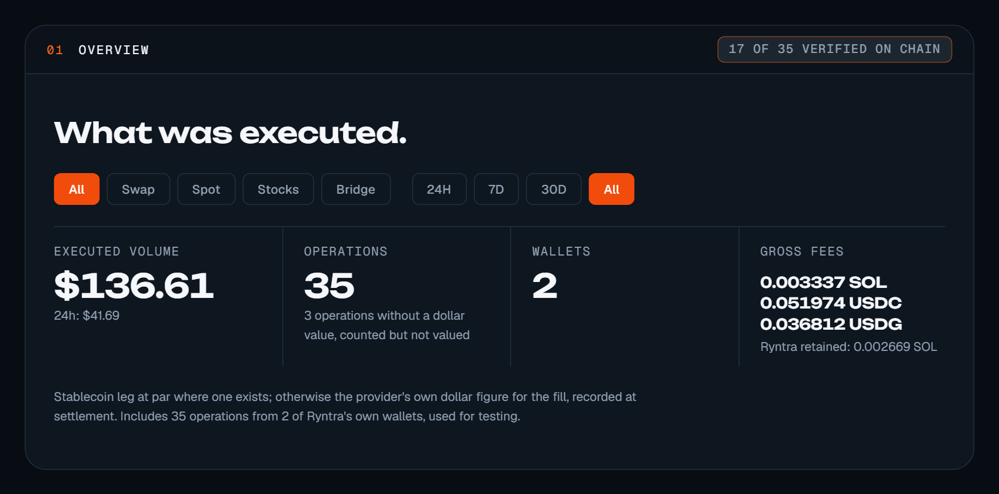

# Analytics

[ryntra.io/stats](https://ryntra.io/stats) shows every operation that went
through Ryntra, as it confirmed — from Ryntra's own operations ledger, verified
against public Solana transactions. A row appears the moment an operation
confirms; nothing is estimated.

*The overview of the public statistics: what was executed, by product and period, with the number of operations verified on chain stated beside the total.*

## Two numbers, kept apart

- **Confirmed operations** — every operation Ryntra recorded as confirmed,
  with the transaction that proves it. Executed volume is the stablecoin leg
  at par where one exists, otherwise the provider's own dollar figure for the
  fill, recorded at settlement.
- **The on-chain attributable subset** — the operations that can be proven to
  be Ryntra's from public chain data alone, by one rule: the provider-native
  identity Ryntra holds (its referral and fee accounts) appears in the
  transaction. This subset is smaller than the total by construction — a
  swap routed without a fee leg leaves no attributable mark — and the two
  numbers are never blended.

## Where the numbers come from

| Figure | Source |
|---|---|
| Operations, volume, wallets, fees | Ryntra's operations ledger — the record the product itself writes on every confirmed operation |
| *Verified on chain* | a read of each transaction from the Solana network, reconciled against the ledger row |
| The attributable subset | the same rule applied to public chain data, independent of the ledger |
| The public dashboard | the attributable subset as public SQL over the chain's transfers, linked from the page |

Every row links to its transaction on a public explorer; the page's *How this
is counted* section states the rule in one paragraph.

## What the statistics include

The figures include Ryntra's own operations made while building and testing
the product, and the page says how many and from how many wallets. Ryntra
publishes the count as it is rather than a count without them.

## Limitations

- Confirmed means confirmed on Solana; a pending or failed operation is not a
  row.
- The attributable subset depends on the provider's fee mechanism leaving a
  mark in the transaction; where it does not, an operation is confirmed but
  not attributable, and the page says so.
- The page reads the chain on a schedule; the header states when the ledger
  and the chain were last read.
