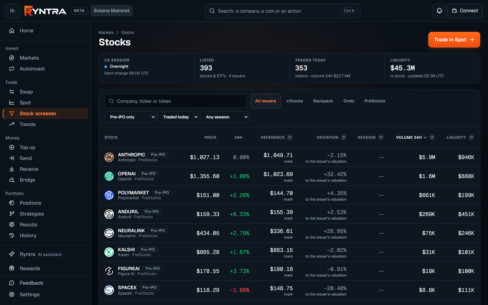
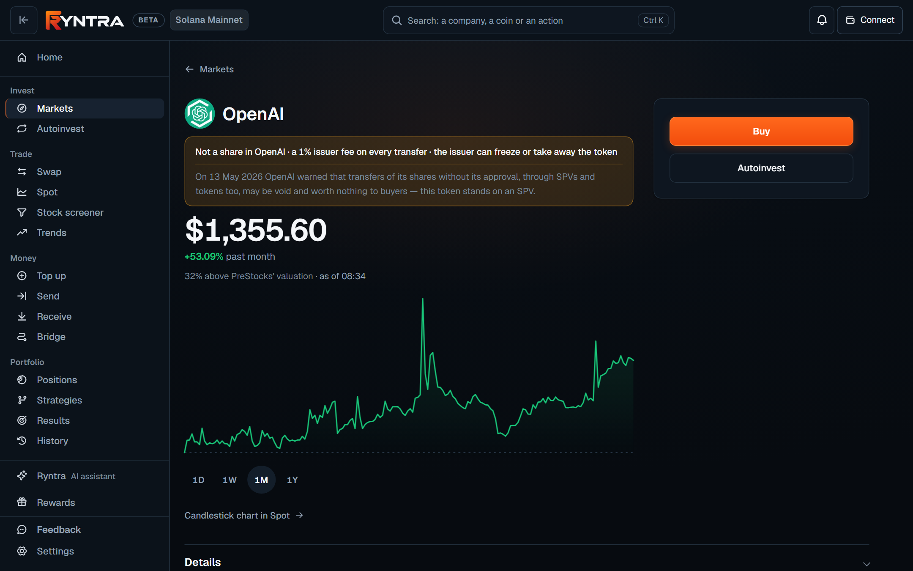
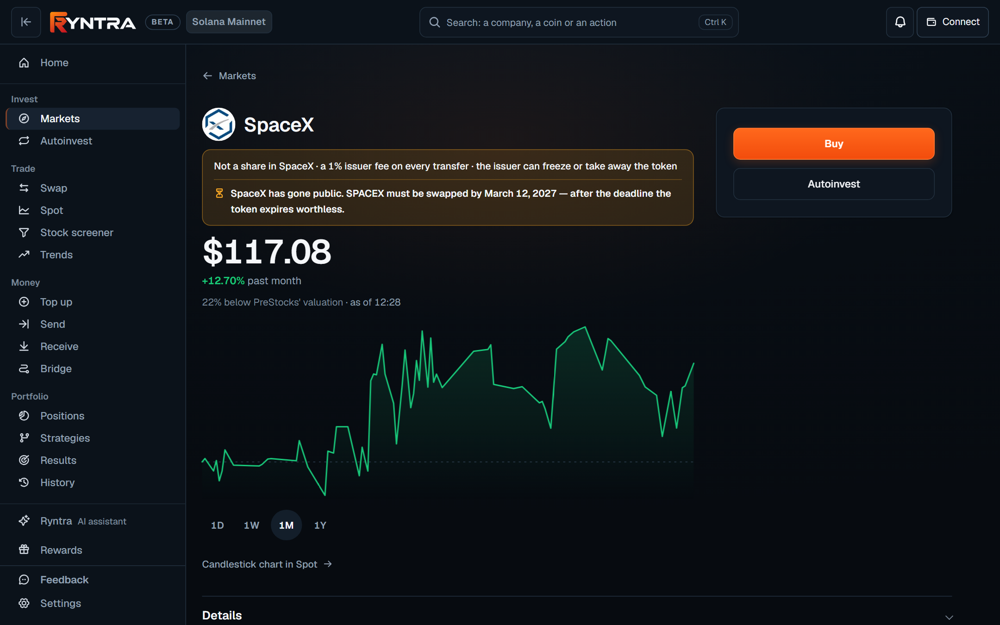
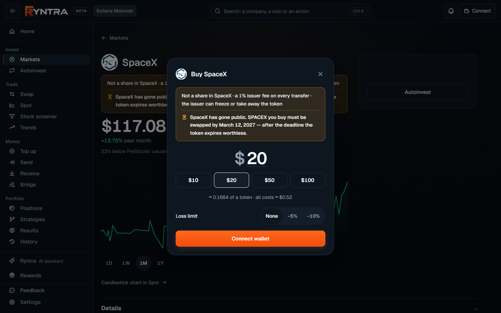
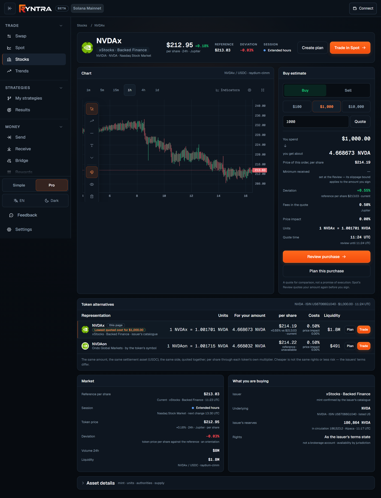

# Tokenized stocks

[ryntra.io/app/stocks](https://ryntra.io/app/stocks) lists stocks as tokens
on Solana — listed equities and ETFs, and exposure to companies before an
IPO — and answers, on every asset page, the four questions a token's price
alone does not: who issues it and what kind of instrument it is, what one unit
means, whether the reference price is current, and whether the issuer still
supports the token.

## The company page

Each company's page says first what the company is, then what the token is.
Under the name stand its ticker, its exchange and its industry. At rest the
page shows, each figure with its source and date:

- **Key statistics** — market value, price to earnings, revenue and net
  income over the last twelve months and the dividend, from the company's own
  periodic filings with the SEC (read into the product with the filing's date
  and a link to it; the page itself does not call the SEC), and the token's
  price over the year.
- **About the company** — what it does in one line, its industry,
  headquarters, exchange and ticker, fiscal year and latest report.
- **What you buy** — the issuer's label for the instrument, the backing from
  the issuer's proof of reserves where the issuer publishes one, what happens
  to dividends, and whether the issuer takes a fee on a transfer.
- **Trading on Solana** — the day's volume, liquidity, holders, traders,
  trades and the share of buys.

A fund has no revenue or earnings of its own and shows none. A foreign issuer
reports in its own currency and per ordinary share, so nothing of its filings
is set against the token's price. A company new to the filings shows its
latest report's months rather than a year. A figure no source states is not
drawn.

### The company's path

Under the company's name one strip draws where the company stands, in four
steps — private (the PreStocks token), the IPO, the exchange and the token on
Solana — each passed, current or not announced yet, with its date and its
sources one press deeper. SpaceX has a token at two of those steps: the
PreStocks token from before its listing and xStocks' SPCXx after it. Both
pages draw the same strip; each marks the step of its own token, says what
that token is — not a share, with the issuer's 1% fee on every transfer, or
backed 1:1 with no vote — and opens the other in one press. Under the strip
stands the day the PreStocks token must be swapped, with the issuer's minute
in UTC. The IPO's price and first day of trading are read from the company's
own filings with the SEC. A private company that has announced nothing stands
at the first step, with the issuer's rule: after an IPO, up to nine months to
swap the token.

## Issuers and confirmation

A token is a stock here only when the issuer's own catalogue lists its mint.
Ryntra reads the catalogues of **xStocks (Backed Finance)**, **Backpack**,
**Ondo** for listed equities and ETFs, and **PreStocks** for private
companies — the one issuer of pre-IPO tokens Ryntra shows. A token an issuer
does not list is not shown as a stock, whatever a pool quotes. The issuer, the
underlying and the exchange are stated on the asset page, with a link to the
issuer's own page.

Tokens of another pre-IPO issuer are no longer supported: no list, search,
plan or order offers them, and a person who holds one, or wrote a plan or
bought one before, reads it as history — *no longer supported*, to be sold in
their own wallet.

*The screener on Pre-IPO only: PreStocks' eight companies; the column that would hold a market reference holds the issuer's own mark, and the column that would hold a deviation holds the token against the issuer's valuation — each labelled as such.*

## Units

On Solana a listed-equity token is a Token-2022 mint with the Scaled UI Amount
extension: the raw balance never changes on a corporate event, and an
issuer-set multiplier changes what the balance means. Ryntra reads the
multiplier from the chain, converts raw amounts to the units a holder
economically owns with integer arithmetic, and puts a token price and a
per-share reference on one basis before comparing them. The multiplier is
applied once, and the page says which unit every figure is in. For xStocks
the issuer reinvests dividends by raising the multiplier, so the page says
they are already in your amount — not a payout to an account. A holding in
the portfolio is counted and valued in the same unit the wallet shows — the
raw balance through the multiplier in force — so a token with a five-for-one
split reads as the wallet reads it, not as a fifth of it.

A pre-IPO token is priced **per token** — the only unit its issuer has stated
in a way that can be checked — and the plan built on it says so.

## Reference prices and sessions

Beside the token's market price the asset page shows the issuer's reference
price for the underlying share and the exchange session — market, extended
hours, overnight, closed — from the issuer's own feed or from a price feed
such as Pyth where the issuer publishes none. The reference carries a state
that is never promoted: *current* when the exchange is open and the figure is
fresh, *last available* when the exchange is closed, *stale* when the source's
own observation time is too old, *unavailable* when nobody stated a figure.
Freshness is judged from the source's observation time, not from the moment
the page fetched it.

The **deviation** is the executable per-share price of a concrete quote
against the reference, as a percentage — a fact about this quote against this
reference at this time, not a signal.

For a pre-IPO token the issuer's own figure is shown as **the issuer's mark**.
It has no observation time, it is the issuer's derivation, and no plan rule
reads it as a reference. The one number a private company's card and page
carry beside its price is the token against that valuation — *30% above
PreStocks' valuation* — with the time the valuation was read, and no tone of
good or bad.

*A private company's page: the truth before any figure — not a share, the issuer's fee on every transfer, the issuer can freeze or take the token — the company's own dated statement about tokens like it, and the price with its one number.*

## Rights

What a holder has is stated in the issuer's own terms, never as a legal
opinion: the listed-equity issuers' terms; **price exposure, not a share**
for PreStocks tokens (economic exposure through a holding entity, no ownership,
voting, dividend or information rights). A PreStocks mint withholds the
issuer's fee on every transfer — 1 % today, read from the chain — and its own
settings let the issuer freeze the token, pause transfers, and move or burn it
from any wallet; the page says so before any figure. Where a company has
spoken about tokens like it, that dated statement stands beside the truth, its
sources one press deeper. Availability by jurisdiction is the issuer's, and
the issuer's page is linked beside the statement.

## Lifecycle

Whether a new purchase is offered comes from three facts in order of strength:
a pause on the mint itself stops everything; a verified issuer notice says
what the issuer supports now — a conversion window with the issuer's own
cut-off, a redemption period, an expiry; the issuer's catalogue listing the
mint today says it is offered. A conversion window is treated as expired the
moment the clock passes the issuer's cut-off. A paused, redeem-only or expired
token is not offered for purchase, whatever a pool still quotes; holdings and
history stay visible, and selling a token one holds is the person's own
decision.

### When a private company goes public or is bought

A pre-IPO token can have a deadline. When the company goes public or is
acquired, its issuer opens a window to swap the token — into the listed
company's token or any other — and after the issuer's cut-off the token
expires worthless. SpaceX's PreStocks token is one today: the issuer's window
into xStocks' SPCXx, or any other token, is open until 23:59 UTC on 12 March
2027. Ryntra says so on the token's page before any figure, and again before a
purchase: a token bought now must be swapped by that date.

*A private company that has gone public: what the token is, and under it the issuer's swap deadline — before the price, for everyone.*

A holder reads it on the page, in the portfolio and in their notes, with one
action — swap into the listed token — and a quieter one, sell for USDC. The
swap is an ordinary trade at the live quote, as the issuer itself describes
the conversion; its Review shows what leaves the wallet, what arrives at
least, all costs with the issuer's 1% fee on its own line, and the rate
against the company's price on the exchange. No ratio is promised. A holder
is reminded on the day Ryntra first sees the token in their wallet and 90,
30, 7 and 1 days before the deadline — never more than once a day, a missed
reminder never caught up — in the app and on Telegram if they connected it.
The issuer's product pages are read against Ryntra's registry of events every
day; a change is verified by a person before anyone is told.

*The purchase of a token with a swap deadline says it before any sum: the token bought now must be swapped by the issuer's date.*

## Comparing tokens of one company

When one underlying has several confirmed tokens, the asset page quotes them
together — the same amount, the same settlement asset, the same side — and
shows the per-share price of each through its own multiplier, its costs and
its liquidity. A cheaper token is not the same rights or less risk; the page
says so. A pre-IPO token and a listed token of the same company — SpaceX after
its listing — are shown side by side but never compared: different
instruments with different rights and their own units.

*A listed-equity asset page: the reference and the session, the estimate per share through the token's multiplier, and the token alternatives of the same company quoted for the same amount.*

## Buying with a loss limit

The asset page starts with **Buy**. Type any amount from one dollar — the
sheet opens on $10 — or take 25%, 50%, 75% or 100% of your USDC in one tap;
and, if you want one, a loss limit: **Careful** (limit −5%,
target +10%) or **Balanced** (limit −10%, target +20%). Ryntra prepares the
purchase from those figures as one card: what you can lose at the limit,
including the price cushion the Review allows; where the limit and the target
sit per unit; how you will be warned; and that nothing is bought yet. The card
draws the path every action takes — intent, limits, permission, execution,
proof, oversight — and marks the step you are on.

**Accept and sign** writes the plan and opens the same Review every trade
passes, with the same amount: a fresh executable quote, the plan's price
ceiling and loss limit checked, then your wallet's signature. After the
purchase settles, the plan keeps watching the position against its limit
until the position is closed; reaching it produces one note — on the page,
and on Telegram if you connected it. Ryntra never sells for you: a sale is
yours to open and sign.

A loss limit is a rule of your plan, not an order. The market can move past
it before you act, and you can lose everything you put in.

For a PreStocks token the Review names the issuer's fee on its own line
under all costs — *of which the issuer's fee 1% ≈ $0.10* — and what arrives
is the venue's quote through the token's multiplier, already after that fee,
never reduced by it a second time.

The first purchase of a token opens its account in your wallet, and the
network keeps a small reserve of SOL there — *≈ $0.19 in SOL, once — it stays
in your wallet, on the token's account*. The Review states it on a line of
its own under all costs, because it is not a cost; if it is ever more than
the purchase itself, the Review says so first. Where the live quote finds no
route for the sum typed, the sheet asks the same quote for larger sums and
states the company's own minimum, with one action to use it.

## Open source in this repository

The model behind these pages — instrument class, unit basis and rights; the
transfer fee from a mint's own config; the lifecycle from a pause, a notice or
the catalogue; scaled-unit arithmetic; the state of a reference against a
session — is published as
[`@ryntra/tokenized-stocks`](../../packages/tokenized-stocks/README.md), the
same modules the product runs on.

## Limitations

- Ryntra shows what the issuer states and what the chain holds; it does not
  vouch for an issuer, and the terms are the issuer's.
- A reference may be unavailable or stale; the page says so rather than
  substituting a figure, and a plan may require a current reference before
  its Review passes.
- Pre-IPO issuers restrict availability by jurisdiction in their own terms;
  Ryntra states the restriction and does not work around it.
