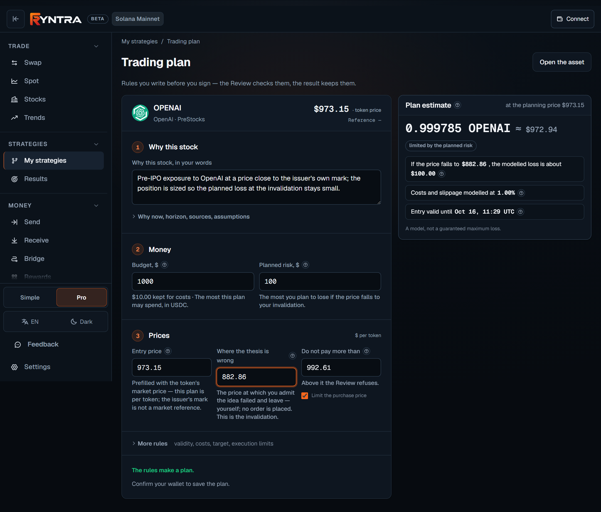
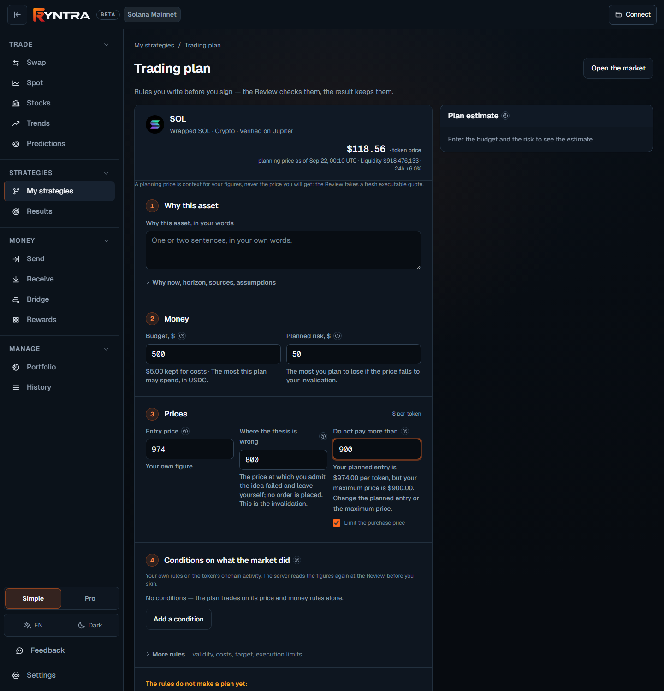

# Trading plans

A Trading Plan is the set of rules a person writes **before** they sign: why
this asset, how much money, at what entry, where the thesis is wrong, how the
position exits. The plan is kept with versions under *My strategies*
([ryntra.io/app/strategies](https://ryntra.io/app/strategies)), its size is
computed deterministically from the rules, the pre-signature Review judges the
exact order against it, and the result is recorded beside the plan once the
operation is done.



*The plan builder: the thesis in the person's words, the budget and the planned risk, the entry and the price where the thesis is wrong; the estimate on the right updates as the person types and names what it assumes.*

## The rules

| Step | Rules | Notes |
|---|---|---|
| Why this asset | the thesis in the person's words; optionally why now, the horizon, sources and assumptions | the thesis is kept with every version |
| Money | the budget; the planned risk — the most the person plans to lose if the price falls to the invalidation | a reserve for costs is kept back from the budget |
| Prices | the entry; the price where the thesis is wrong (the invalidation); an optional maximum entry price above which the Review refuses | per underlying share, or per token for a pre-IPO instrument |
| More rules | the entry's validity, the modelled cost buffer, an optional target and time exit, the slippage bound, the maximum quote age, the maximum reference deviation, whether a reference is required, a minimum liquidity | each with a default that holds |

The invalidation is a rule the person acts on, not an exit order: the plan
places no order at that price, and the page says so.

## A plan on a token

Since 22 September 2026 the same plan reaches SOL, any crypto and any meme
on Jupiter's verified list, beside the tokenized stocks. The builder's one
field searches both. A token plan is priced per token; the entry is prefilled
with the market price Jupiter stated, shown with its time as **planning
context** — never the price the person will get, which is the fresh executable
quote the Review takes — and, when no indication is available, left for the
person's own figure: nothing is invented. Every version keeps the planning
price it was written against, with its source and time. A token has no issuer
reference, so no deviation bound and no reference rule are offered on it; the
Review says *not applicable* for those two checks and judges the rest as it
judges a stock — the entry bound, the money, the slippage, the quote's age,
the pool's liquidity from the catalogue. A contradiction between two prices is
said with the person's figures and the next action as soon as both are
written: *your planned entry is $974.00 per token, but your maximum price is
$900.00 — change the planned entry or the maximum price.*



*A plan on SOL: the indication with its time as planning context, the prices per token, the estimate computed beside the form.*

## The size

```
lossPerShare        = entry − invalidation + entry × costBufferBps / 10 000
riskLimitedUnits    = plannedRiskUsd / lossPerShare
capitalLimitedUnits = (budgetUsd − reserveForCostsUsd) / entry
units               = min(riskLimitedUnits, capitalLimitedUnits)
notionalUsd         = units × entry
```

The size is limited either by the planned risk or by the budget, and the
estimate says which. Costs are modelled once, in the loss per share; the
budget is spent net of the reserve; nothing is subtracted twice. The same
function sizes the form in the browser and the stored version on the server,
so no client keeps a second financial logic. It is published as
[`@ryntra/trading-plans`](../../packages/trading-plans/README.md), with the
reader of decimal input the builder uses (`0,5` is a half; an empty field is
never zero).

The figure is a planning model under stated assumptions. A gap through the
invalidation, slippage, missing liquidity or a missed exit change what is
lost; the assumptions travel with the figure and are shown beside it.

## From the plan to the deal

1. The person opens the asset from the plan (or the plan from the asset) and
   types the amount in Spot.
2. The Review's **Strategy block** judges the exact order against the plan:
   the executable price against the entry bound, the amount against the budget
   net of the reserve, the modelled loss against the planned risk, the quote's
   deviation against the plan's reference rule (a stock; a token has none),
   the quote's age and slippage against the plan's execution limits. A rule that
   fails refuses the order and is named — once, in one sentence with the
   figures and the next action, above the checks; and the Review answers four
   questions first: what leaves the wallet, what arrives at least, all costs,
   whether the order fits the plan.
3. The wallet signs; the execution is bound to the plan version it was judged
   against.
4. The result — what was executed, at what price, against what was planned —
   is recorded with the plan under *Results*.

## Conditions on what the market did

A plan can carry rules on the token's onchain activity beside its price and
money rules.

- **Analysis** on the asset page reads a few figures from an external
  onchain source when the person asks — the day's or the week's DEX trading
  volume with its buys and sells, the net movement of the token to or from
  the addresses the source labels as exchanges or as large holders — each
  with the time Ryntra asked, how far behind the source may be, and the
  source named beside the figures. A movement is not a trade and a label is
  not a person; a figure the source does not have is a dash, never a zero.
- **Add a condition to the plan** turns one figure into a rule: which figure,
  over which window, at least or at most, a threshold the person writes, and
  what happens when the rule is not met — warn and leave the decision to the
  person, or refuse the order. Movements of labelled groups can only warn.
- **At the Review** the server reads the figure again and judges the rule
  beside the checks on the money and the deal. A rule that cannot be judged —
  the source silent, the figure missing, the observation older than its
  window — is never a pass, so a rule that refuses also refuses then. The
  Review keeps what it judged; Results shows it beside the fill. The figures
  stay with that review for a bounded time under the source's terms; the
  verdict stays for good.

## Rules on how the token is built

A second source answers a different question — not what the market did, but
how the token itself is built.

- **Risk & due diligence** on the asset page reads it when the person asks:
  how much of the supply the ten largest holders hold together and how many
  addresses hold the token, whether the mint authority and the freeze
  authority are present or renounced, whether the token takes a tax on every
  transfer, and — as the source's own labels on addresses from the token's
  first moments — what early snipers, bundled buyers and the developer hold
  now. Each fact says when the source last analysed the token and how far
  behind it may be. An issuer-backed instrument is read in its own context:
  a supply held by the issuer's own accounts and a kept freeze right are the
  design of a tokenized stock, and the card says so beside the figure. There
  is no score and no verdict — the state in the card's head counts facts and
  never says *safe*.
- **Any of these facts can become a rule** of the plan the same way: the
  top-ten share at most a bound the person writes, the holder count at least
  a figure, the transfer tax at most a percent, an authority renounced or
  present. The early-holder shares are the source's classification of
  addresses and can only warn, never refuse.
- **At the Review** the server reads the token's structure again and judges
  every rule beside the price and money checks; a required rule refuses the
  version when the fact is not what the person wrote, or when the source did
  not answer, answered too long ago, or cannot analyse the token. A trade
  outside a plan, and a plan without such a rule, never waits on this source.
- **Before a transfer**, Send shows a recipient check from the same source —
  whether the address is on a sanctions list the source keeps and whether the
  source found anything about it — never a verdict, never a block; a program,
  a vault or an exchange contract the source cannot analyse is said to be
  unsupported, not clean.

The registry of what a condition may name, the observation's shape, the
validator and the judge, the rights maps and both adapters are open source in
[`@ryntra/evidence`](../../packages/evidence/README.md).

## What a plan is not

- Not advice. Ryntra checks the person's own rules; it does not write them.
  An onchain figure is context for a rule, not a price, a quote or a
  recommendation; a met condition says the rule held at that moment.
- Not an order. No entry, stop or target order is placed by a plan.
- Not a promise. The modelled loss is a model; the market decides what is
  lost.
