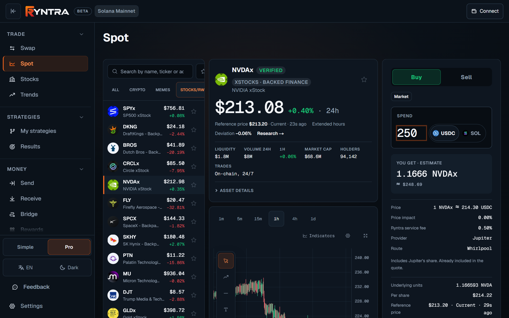

# Trading

Ryntra trades on Solana through the person's own wallet: a swap form, a spot
terminal for crypto, memes and tokenized stocks, and a bridge for USDC. One
engine executes all of it; one Review runs before every signature; one
history keeps what happened.

## Swap

[ryntra.io/app/swap](https://ryntra.io/app/swap) — one form over three
execution providers:

- **Jupiter** for swaps on Solana;
- **Circle CCTP** for USDC between Solana and Base — burn on the source chain,
  Circle's attestation, mint on the destination, read back independently;
- **Mayan** and **Relay** for cross-chain routes to further networks.

The ticket names the provider, the route, the price impact, the service fee
and the estimate of what the person receives. A quote is a quote: the Review
quotes the amount again before the wallet signs, and the minimum received is
set there, under the slippage bound the person accepted.

## Spot

[ryntra.io/app/spot](https://ryntra.io/app/spot) — a market terminal on the
same engine: the market list (all, crypto, memes, stocks/RWA), a chart that is
the market's own trades, the ticket, and the asset's details. Every listed
market executes; a fill reads as a fill; balances are read back after the
operation rather than assumed.

For a tokenized stock the ticket adds the reference price and its state, the
deviation of the quote from the reference, the underlying units the amount
buys through the token's own multiplier, and the per-share price — see
[Tokenized stocks](tokenized-stocks.md).

*The Spot terminal on a tokenized stock: the quote names the provider and the route, the service fee inside the price, and the underlying units and per-share price behind the token amount.*

## Bridge

[ryntra.io/app/bridge](https://ryntra.io/app/bridge) — USDC between Solana
and Base through Circle's CCTP, and further networks through Relay, each
measured against its provider before it was listed. A transfer is one card
that crosses two chains: plan, burn, attestation, mint, observation and
recovery; it survives a closed tab and resumes where it stood; Standard and
Fast are shown against each other with both fees before the signature.

## Fees

Ryntra charges a service fee of **0.50 %** on swaps, collected through each
provider's own fee mechanism and already included in the quote shown — never
added on top afterwards. A token's own transfer fee (a Token-2022 mint's
withholding) is read from the chain and shown separately, inside the route's
figures, and is not Ryntra's fee. Network fees are the network's.

## From a quote to a confirmed operation

1. **Quote.** The provider quotes the amount; the ticket shows the estimate,
   the fees and, for a stock, the reference and the units.
2. **Review.** Before the wallet is asked to sign, the Review quotes again and
   checks the order — the slippage bound, the quote's age, the reference
   deviation, the transfer fee, and the person's own Trading Plan when there
   is one. A check that fails refuses the order and says which rule refused.
   See [Risk review](risk-review.md).
3. **Signature.** The person's wallet signs; Ryntra holds no key.
4. **Submission, once.** The transaction is submitted through a one-shot
   boundary; a signed transaction is not lost when the tab reloads, and
   recovery reads the chain on the person's behalf.
5. **Record.** The confirmed operation is written to Ryntra's own operations
   ledger with its transaction signature, appears in History and Portfolio,
   and is verified against the public chain for the statistics — see
   [Analytics](analytics.md).

## Rewards

A share of the service fee actually collected is returned to the people who
brought the trader: 50 / 10 / 5 per cent across three levels of inviters,
claimable from one dollar, at [ryntra.io/app/rewards](https://ryntra.io/app/rewards).
An inviter is chosen by the person, never assigned.

## Limitations

- Ryntra is in beta and non-custodial; it prepares, reviews, submits and
  records, and the wallet signs.
- Liquidity, price impact and the provider's route are the market's at the
  time of the quote; a quote is not a promise of execution.
- Cross-chain transfers take the time their provider takes; the card shows
  how long a route may take and says what refused when something refuses.
