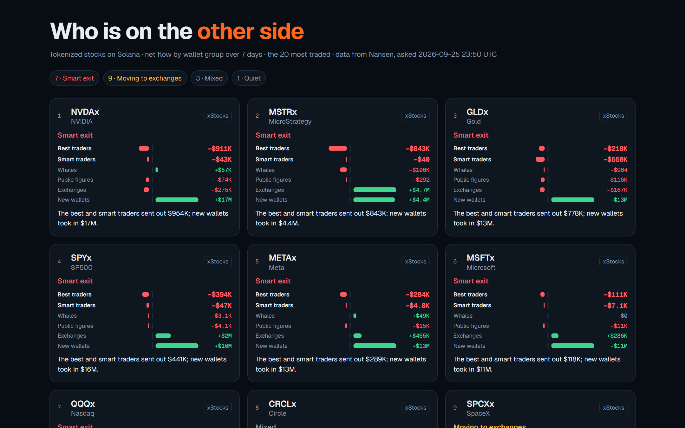
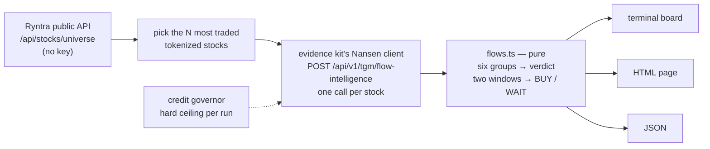

# Who is on the other side

**Before you buy a tokenized stock on Solana, see who is selling it to you.**

`stock-flows` reads [Nansen](https://nansen.ai)'s flow intelligence for the most traded
tokenized stocks on Solana — xStocks, PreStocks, Ondo and Backpack tokens — and splits
each one's week between the wallet groups Nansen labels: the **best traders** by realised
profit, **smart traders**, **whales**, **public figures**, **exchanges** and **new wallets**.
It ranks the board by what the wallets with a record are doing, and before a purchase it
answers one question: **BUY or WAIT**.



On 25 September 2026 the board opened with seven of the most traded tokenized stocks in
the same shape — the best and smart traders sending tokens out while new wallets took
them in:

| Stock | Best + smart traders, 7 days | New wallets, 7 days |
|---|---:|---:|
| NVDAx · NVIDIA | −$954K | +$17M |
| MSTRx · MicroStrategy | −$843K | +$4.4M |
| GLDx · Gold | −$778K | +$13M |
| SPYx · S&P 500 | −$441K | +$16M |
| METAx · Meta | −$289K | +$13M |

A flow is movement, not a trade, and a label is not an identity — but a buyer deserves to
know who is on the other side before signing.

## Run it — about a minute

Node 22.18 or newer. No install: the example uses only Node's standard library and the
evidence kit in this repository.

```bash
git clone https://github.com/ryntra-io/ryntra-solana-evidence
cd ryntra-solana-evidence
export NANSEN_API_KEY=<your key>          # https://app.nansen.ai/api — the free credits are enough

node examples/stock-flows/radar.ts                        # the board: 20 stocks, 20 credits
node examples/stock-flows/radar.ts guard NVDAx            # before a $1 buy: BUY or WAIT, 2 credits
node examples/stock-flows/radar.ts --html radar.html      # the board as a page you can open or share
```

On Windows PowerShell set the key with `$env:NANSEN_API_KEY="<your key>"`. The key is read
from the environment, never printed, never written to a file.

## The guard — one decision before a purchase

```text
$ node examples/stock-flows/radar.ts guard NVDAx
Buy $1 of NVDAx (NVIDIA · xStocks)?
  7d   best traders −$911K · smart traders −$43K · whales +$57K · new wallets +$17M · exchanges −$275K
  24h  best traders −$4.4K · smart traders −$7.4K · whales −$36K · new wallets +$2.6M · exchanges +$131K
  → WAIT — The best and smart traders sent out $954K over 7 days while new wallets took in $17M;
    in the last 24 hours they have not turned buyers (−$12K).
  Rule: wait while the best and smart traders are net sellers over 7 days, unless they bought in the last 24 hours.
  Data: Nansen flow intelligence, asked 2026-09-25 23:51 UTC. Not advice. Powered by Nansen API
```

The exit code is the decision — `0` BUY, `3` WAIT, `2` could not run — so a script or a
trading bot can ask before it acts:

```bash
node examples/stock-flows/radar.ts guard SPYx && ./buy.sh SPYx 1
```

Write your own rule over any group and either window; it replaces the default one:

```bash
node examples/stock-flows/radar.ts guard SPCXx --rule "whale >= 0 7d"
node examples/stock-flows/radar.ts guard METAx --rule "informed >= -100000 24h"
```

Groups: `informed` (best + smart traders together), `top_pnl`, `smart_trader`, `whale`,
`public_figure`, `exchange`, `fresh_wallets`. A read that failed, a window that did not
answer or a figure the provider did not give is always a **WAIT** with the reason — an
unknown is never a pass.

## What the board says

Each stock gets one verdict over the window, checked in this order. A move counts when it
reaches 2 % of the token's daily trading volume, and never less than $10,000 — so $50K
means something for a thin token and nothing for NVIDIA.

| Verdict | When |
|---|---|
| **Smart exit** | the best and smart traders sent out at least the threshold, and new wallets took in at least the threshold |
| **Smart money selling** | the best and smart traders sent out at least the threshold |
| **Smart money buying** | the best and smart traders took in at least the threshold |
| **Moving to exchanges** | at least the threshold moved onto exchange wallets |
| **Whales accumulating** | whales took in at least the threshold |
| **Mixed** | groups moved, but not in one of the shapes above |
| **Quiet** | no group moved the threshold |

The board is ordered by what the best and smart traders did — the largest dollar move
first — then whales, then everything else. Every card of the page draws all six groups
around a centre line: out to the left, in to the right, on a square-root scale so a $900K
move stays visible beside a $17M one; the exact figures are printed beside every bar.

## Options

| | |
|---|---|
| `--top 20` | how many stocks, most traded first (1–400) |
| `--window 7d` | `7d` or `24h` |
| `--issuer all` | `all`, `xstocks`, `prestocks`, `ondo`, `backpack` |
| `--html <file>` | also write the board as one self-contained page |
| `--json` | print the board as JSON — every group, the thresholds, the credit ledger |
| `--max-credits <n>` | a hard ceiling for the run; no call is made past it |
| `--universe <file\|url>` | read the list of stocks from elsewhere |
| `render <board.json> --html <file>` | redraw a board saved with `--json`, offline — no key, no call |

## How it works



- **The list of stocks** comes from [Ryntra](https://ryntra.io)'s public universe — every
  tokenized stock it offers, with its issuer and a day's volume — without a key. If it does
  not answer, the saved [`universe.snapshot.json`](universe.snapshot.json) is used and the
  board says so.
- **Every Nansen call** goes through the kit's own client
  ([`lib/evidence/providers/nansen/client.server.ts`](../../lib/evidence/providers/nansen/client.server.ts)):
  bounded in time, one retry only for what a retry can mend, a rate limit waited out once,
  the key never logged. Each call is reserved with the kit's
  [credit governor](../../lib/evidence/governor.ts) before it leaves and settled on the
  provider's own `x-nansen-credits-*` headers after; the line under the board prints the
  calls, the credits and what is left on the key.
- **The rules** live in [`flows.ts`](flows.ts): pure functions with no network and no clock,
  so the same answer always gives the same verdict, and every rule is tested offline in
  [`flows.test.mjs`](flows.test.mjs) (`node --test examples/stock-flows/flows.test.mjs`).
- **The page** is [`report.ts`](report.ts): one HTML file, no script, every value from
  outside escaped.

## Cost

One credit per stock per window, as the provider's headers report it. The default board is
20 credits; the guard is 2. `--max-credits` stops a run before it crosses your ceiling.

## Reading a flow honestly

- A flow is **movement, not a trade**: tokens that arrived in (above zero) or left (below
  zero) the group's wallets over the window, valued in USD by the provider. Tokens sent to
  another wallet of the same person move too.
- A group is **Nansen's label, not an identity**. *Best traders* are Nansen's top wallets by
  realised profit, *smart traders* its smart-trader label, *new wallets* addresses that
  appeared recently; Nansen does not count wallets for exchanges and new wallets.
- The verdicts describe what moved. They are **not advice** and not a forecast.

## The same check inside Ryntra

[Ryntra](https://ryntra.io/app) lets a person buy a tokenized stock from $1 in their own
wallet. Its review before every signature runs this kind of check — a condition read from
market evidence, judged on the server, where a stale, unknown or unavailable read never
passes ([the evidence layer](../../packages/evidence/README.md)). The product shows its
users only the groups its [rights map](../../lib/evidence/rights.ts) allows it to
redistribute — large holders and exchanges, with Nansen's attribution. This example shows
every group to **you**, read with **your** key, in **your** terminal.

## Files

| File | |
|---|---|
| [`radar.ts`](radar.ts) | the command line: the board, the guard, the page, the JSON |
| [`flows.ts`](flows.ts) | the rules: parsing, thresholds, verdicts, the guard, the universe |
| [`report.ts`](report.ts) | the page |
| [`flows.test.mjs`](flows.test.mjs) | network-free tests |
| [`universe.snapshot.json`](universe.snapshot.json) | the saved list of stocks, used only when the live one does not answer |

Data: [Powered by Nansen API](https://nansen.ai). Licence: Apache-2.0, as the repository.
